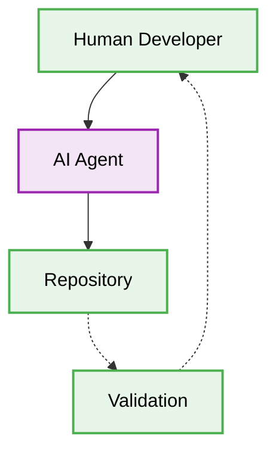

# 🪄 Vibe Coding Patterns Production-Ready Best Practices

# Context & Scope
- **Primary Goal:** Document the ecosystem of patterns for writing code seamlessly integrated with AI orchestration.
- **Target Tooling:** AI Agents and Human Developers.
- **Tech Stack Version:** Agnostic

<div align="center">
  

  **Deterministic blueprints for vibe coding.**
</div>

---
## 🗺️ Map of Patterns (Vibe Modules)

This architecture defines how human developers and AI orchestration systems collaborate efficiently.

- [🌊 Data Flow](./data-flow.md)
- [📁 Folder Structure](./folder-structure.md)
- [🛠️ Implementation Guide](./implementation-guide.md)
- [⚖️ Trade-offs](./trade-offs.md)



## 🚀 The Core Philosophy

Vibe Coding emphasizes maintaining context and explicit boundaries, ensuring deterministic workflows with zero-approval AI agent execution.

### ❌ Bad Practice
```typescript
function writeCode(data: any) {
  // Unclear structure, reliance on non-deterministic context
  return process(data);
}
```

### ⚠️ Problem
Using `any` and implicit rules causes massive hallucinations in AI agents. Ambiguous constraints lead to corrupted system states.

### ✅ Best Practice
```typescript
interface CodePayload {
  readonly id: string;
  readonly metadata: unknown;
}

function processPayload(data: CodePayload): void {
  if (typeof data.metadata === 'object' && data.metadata !== null) {
      // Deterministic evaluation with proper Type Guards
  }
}
```

### 🚀 Solution
Implementing strict structural boundaries, explicit type definitions, and clear modular isolation guarantees system stability. AI agents can autonomously generate, validate, and execute precise code when constraints are strictly maintained.