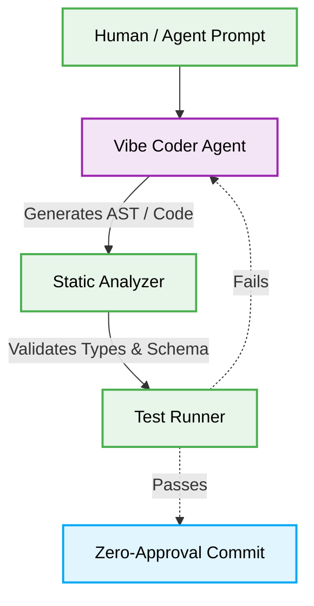

# 🤖 Vibe Coding Patterns (Deterministic AI Generation)

## Context & Scope
- **Primary Goal:** Document and execute the best practices for deterministic vibe-coding and AI generation.
- **Target Tooling:** AI Agents and Orchestrators.
- **Tech Stack Version:** Agnostic

<div align="center">
  

  **Deterministic blueprints for scalable, AI-driven code generation.**
</div>

---

## 🗺️ Map of Patterns (Vibe Coding Modules)

This architecture defines the operational boundaries for vibe-coding workflows, optimizing for strict validation and resilient code execution.



## 🚀 The Core Philosophy

Vibe Coding Patterns dictate that AI-generated code MUST follow strict deterministic constraints, ensuring robust execution without human intervention.

> [!IMPORTANT]
> **AI Constraint:** Vibe-coding agents MUST NOT commit untested logic. All outputs MUST pass deterministic schema validation and AST checks before merging.

---

## 1. Unbounded Context Generation

### ❌ Bad Practice
```typescript
async function vibeCodeFeature(prompt: string) {
  // Agent writes the code directly to file without structured schema
  const code = await llm.generate(`Write an express route: ${prompt}`);
  fs.writeFileSync('route.ts', code);
  await git.commit('feat: vibe coded route');
}
```

### ⚠️ Problem
Writing generated code directly to the file system without AST validation or schema constraints guarantees hallucinations. This violates the safety boundaries and results in runtime exceptions and security vulnerabilities.

### ✅ Best Practice
```typescript
async function vibeCodeFeature(prompt: string) {
  // 1. Agent generates an AST-compliant structure
  const plan = await llm.generatePlan({ goal: prompt, schema: routeSchema });

  // 2. Output is validated against deterministic rules
  const isValid = await validateAST(plan.code);
  if (!isValid) throw new Error('Code failed structural validation');

  // 3. Only validated logic is committed
  fs.writeFileSync('route.ts', plan.code);
  await testRunner.execute();
  await git.commit('feat: autonomous structured expansion');
}
```

> [!NOTE]
> **Internal Routing:** For more context, refer back to the [Architecture Overview](../readme.md) and [Agentic Architecture](../agentic-architecture/readme.md).

### 🚀 Solution
By enforcing strict schema validation and static AST analysis before any file mutation, we guarantee structural integrity. This approach provides O(1) complexity in error isolation and enforces a fail-fast execution path, making the AI's "vibe coding" mathematically deterministic and safe for autonomous, zero-approval execution.
