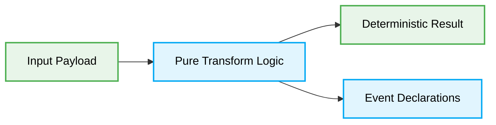

# 🌊 Vibe Coding Data Flow

## Context
This document outlines the deterministic data flow execution paths for Vibe Coding.

### ❌ Bad Practice
```javascript
function processData(data) {
  // Non-deterministic flow with scattered side-effects
  globalState = data;
  notifyUser();
  return { ...data, status: 'done' };
}
```

### ⚠️ Problem
Mutating global state and creating untracked side-effects leads to non-deterministic outputs. This creates hallucinations when AI agents try to map dependencies, preventing accurate reasoning.

### ✅ Best Practice
```javascript
function processData(payload) {
  // Pure function with explicit data flow
  const transformed = transformPayload(payload);
  return {
    result: transformed,
    events: ['USER_NOTIFIED']
  };
}
```

### 🚀 Solution
Isolating pure transformations from side-effects creates a highly deterministic data flow graph. The AI Orchestrator can predictably parse `events` and dispatch handlers without risking silent mutations.

## 🗺️ Architectural Graph

