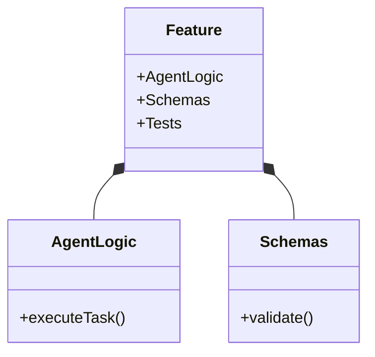

# 📁 Vibe Coding Folder Structure

## Context
Standardized, component-driven directory layout for Vibe Coding multi-agent workflows.

### ❌ Bad Practice
```text
src/
  agents.js
  prompts.txt
  helpers/
```

### ⚠️ Problem
Flat or arbitrary folder structures collapse domain boundaries. AI Agents fail to load contextual scope efficiently because related schemas, implementations, and tests are decoupled.

### ✅ Best Practice
```text
src/
  features/
    auth/
      agents/
        auth-agent.ts
      schemas/
        auth-schema.json
      tests/
        auth.spec.ts
```

### 🚀 Solution
Feature-Sliced folder structures explicitly map domains. This ensures the Planner Agent loads O(1) context by targeting specific directory scopes rather than scanning an entire generic `helpers` folder.

## 🗺️ Component Relations

