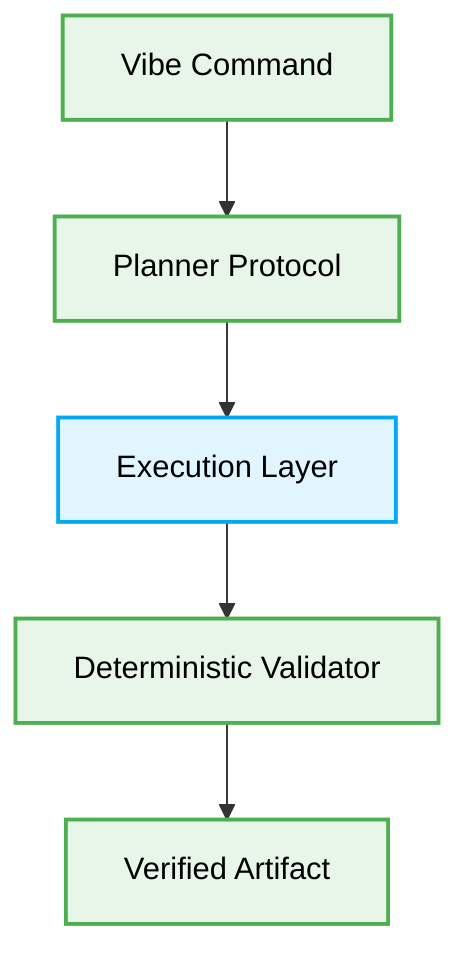

# 🤖 Vibe Coding Architecture Production-Ready Best Practices

# Context & Scope
- **Primary Goal:** Document and execute the best practices for Vibe Coding and Autonomous Orchestration.
- **Target Tooling:** Multi-Agent Systems.
- **Tech Stack Version:** Agnostic

  

  **Deterministic blueprints for Vibe Coding execution pipelines.**

---
## 🗺️ Map of Patterns (Vibe Coding Modules)

This architecture defines strict human-to-AI and AI-to-AI interfaces to ensure absolute determinism.

- 🌊 **[Data Flow](./data-flow.md):** Orchestrator-to-Worker execution paths.
- 📁 **[Folder Structure](./folder-structure.md):** Modular isolation of feature logic.
- ⚖️ **[Trade-offs](./trade-offs.md):** Latency vs. Reasoning depth.
- 🛠️ **[Implementation Guide](./implementation-guide.md):** AI persona rules.

