# 🤖 Vibe Coding Patterns Production-Ready Best Practices

## Context & Scope
- **Primary Goal:** Establish deterministic, high-fidelity protocols for AI-driven code generation and vibe coding.
- **Target Tooling:** AI Agents and Human Orchestrators.
- **Tech Stack Version:** Agnostic

<div align="center">
  

  **Deterministic constraints for zero-hallucination AI coding.**
</div>

---
## 🗺️ Process Workflow

This architectural blueprint outlines the required constraints when performing AI-driven development. It explicitly replaces conversational code generation with deterministic, strictly validated pipelines.

```mermaid
graph LR
    User[Human Orchestrator] --> Prompt[Deterministic Prompt]
    Prompt --> Agent[AI Agent]
    Agent --> AST[AST Validation]
    AST --> Test[Unit Test Guard]
    Test --> Commit[Zero-Approval Commit]

    %% Design Token Styles
    classDef default fill:#e1f5fe,stroke:#03a9f4,stroke-width:2px,color:#000;
    classDef component fill:#e8f5e9,stroke:#4caf50,stroke-width:2px,color:#000;

    class User component;
    class Prompt default;
    class Agent component;
    class AST default;
    class Test default;
    class Commit component;
```



## 🚀 The Core Philosophy

Vibe Coding relies on establishing unyielding boundaries for AI agents. By mandating runtime type verification and strict AST checks, we convert non-deterministic text generation into mathematically provable code transformations.

> [!CAUTION]
> **Constraint:** Agents MUST NOT bypass static analysis. All generated payloads MUST undergo synchronous type checking before entering the build pipeline.

---

## 1. Runtime Type Safety in Generated Snippets

### ❌ Bad Practice
```typescript
function parseAIGeneratedPayload(payload: any) {
  // Agent attempts to parse dynamic output without type guards
  return payload.data.items.map((item: any) => item.value);
}
```

### ⚠️ Problem
Using the `any` type in generated code completely eliminates the TypeScript compiler's static safety net. This allows hallucinations (e.g., missing nested keys) to pass undetected, resulting in catastrophic runtime exceptions (e.g., `TypeError: Cannot read properties of undefined (reading 'items')`). This practice inherently decreases system security by opening vectors for injection attacks through unvalidated data shapes.

### ✅ Best Practice
```typescript
function parseAIGeneratedPayload(payload: unknown) {
  if (
    typeof payload === 'object' &&
    payload !== null &&
    'data' in payload &&
    typeof (payload as { data: unknown }).data === 'object' &&
    (payload as { data: unknown }).data !== null &&
    'items' in (payload as { data: { items: unknown } }).data &&
    Array.isArray((payload as { data: { items: unknown } }).data.items)
  ) {
    return (payload as { data: { items: Array<{ value: unknown }> } }).data.items.map(
      (item) => item.value
    );
  }
  throw new Error("Invalid payload structure detected by Agent.");
}
```

> [!NOTE]
> **Internal Routing:** For more context, refer back to the [Agentic Architecture](../agentic-architecture/readme.md) directory.

### 🚀 Solution
By strictly substituting `any` with `unknown` and enforcing explicit Type Guards, the system achieves deterministic runtime safety. This technically justifies the recommendation by guaranteeing O(1) complexity structure verification prior to execution. Performance is optimized by preventing downstream cascading errors, and security is heightened because malformed or hallucinated attributes cannot execute within the deterministic boundaries.
