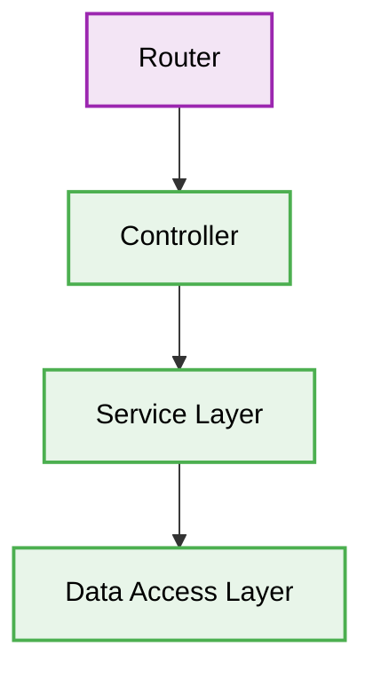

# 🏗️ Express.js Architecture Best Practices

[⬅️ Back to Parent](./readme.md)


## 1. 🛑 God Controllers
### ❌ Bad Practice
```javascript
app.post('/users', async (req, res) => {
  // Parsing logic
  // Validation logic
  // DB query
  // Send email
  // Return response
});
```
### ⚠️ Problem
Mixing routing, business logic, and data access in a single function violates the Single Responsibility Principle, making the code impossible to unit test and maintain.
### ✅ Best Practice
```javascript
// Controller merely orchestrates
const userController = async (req, res, next) => {
  try {
    const user = await userService.createUser(req.body);
    res.status(201).json(user);
  } catch (err) {
    next(err);
  }
};
app.post('/users', userController);
```
> [!NOTE]
> **Internal Routing:** [./readme.md](./readme.md)


> [!NOTE]
> **Internal Routing:** For more context, refer back to the [Expressjs Index](./readme.md).

### 🚀 Solution
Implement the layered architecture pattern. Controllers handle HTTP concerns, Services handle business rules, and Repositories handle database interactions.

## 2. 🗂️ Architectural Workflow


