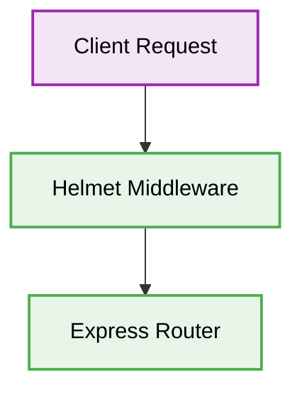

# 🔒 Express.js Security Best Practices


## 1. 🛑 Exposing Server Information
### ❌ Bad Practice
```javascript
// Express sends 'X-Powered-By: Express' header by default
const app = express();
```
### ⚠️ Problem
Exposing the underlying technology stack provides attackers with valuable reconnaissance information to target framework-specific vulnerabilities.
### ✅ Best Practice
```javascript
const helmet = require('helmet');
const app = express();
app.use(helmet());
```
### 🚀 Solution
Use the `helmet` middleware to secure Express apps by setting various HTTP headers that mitigate common cross-site scripting (XSS) and clickjacking attacks.

## 2. 🗂️ Architectural Workflow


