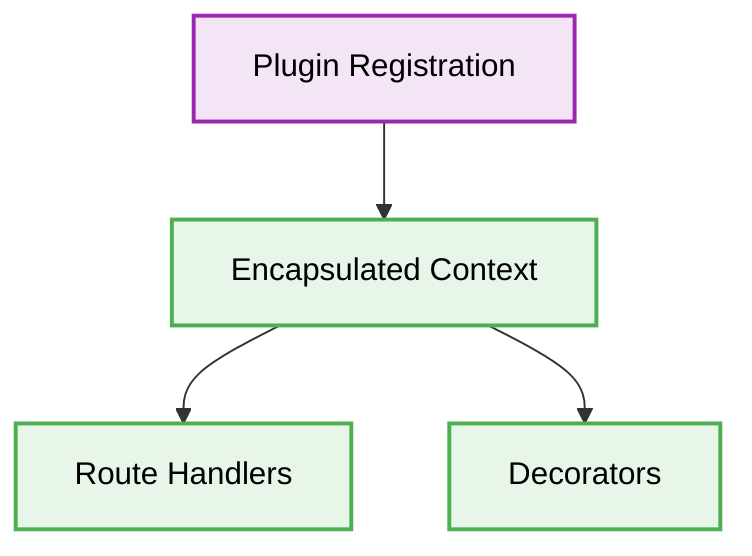

# 🏗️ Fastify Architecture Best Practices

[⬅️ Back to Parent](./readme.md)

## 1. 🛑 Global Middleware Soup
### ❌ Bad Practice
```typescript
// Applying heavy logic to every request regardless of route
fastify.addHook('onRequest', async (request, reply) => {
  await someHeavyDatabaseCheck(request.headers.token);
});
```
### ⚠️ Problem
Using global `onRequest` hooks for heavy operations, like database checks, blocks the Node.js event loop and drastically reduces Fastify's performance advantages. This pattern creates unnecessary bottlenecks for unauthenticated or static routes.
### ✅ Best Practice
```typescript
// Plugin encapsulation for scoped execution
import fp from 'fastify-plugin';

const authPlugin = fp(async (fastify, opts) => {
  fastify.decorate('verifyToken', async (request, reply) => {
    // Perform targeted check
  });
});

// Apply ONLY to necessary routes
fastify.get('/secure', { preHandler: [fastify.verifyToken] }, async (request, reply) => {
  return { secure: true };
});
```

> [!NOTE]
> **Internal Routing:** For more context, refer back to the [Fastify Index](./readme.md).

### 🚀 Solution
STRICTLY encapsulate cross-cutting concerns (like authentication or tenant resolution) inside fastify-plugins and apply them specifically as `preHandler` hooks to targeted routes rather than globally.

## 2. 🗂️ Architectural Workflow


