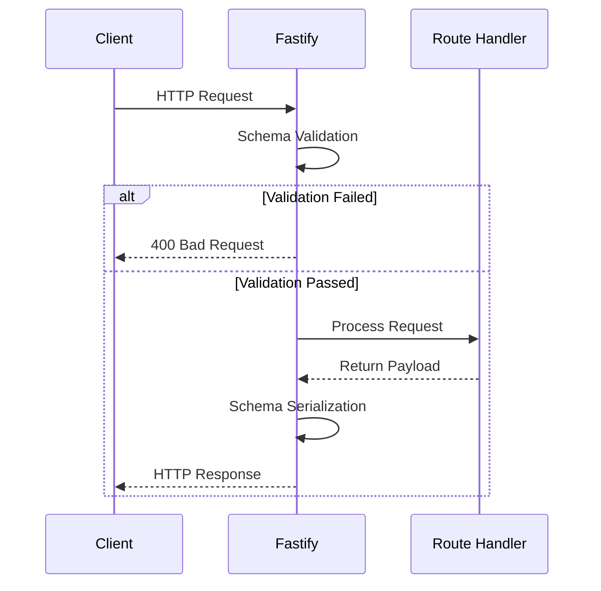

# 🚀 Fastify Production-Ready Best Practices

[🏠 Back to Home](../../README.md)

This document establishes best practices for Fastify architecture to ensure maximum throughput and deterministic validation.

---

## 1. 🛑 Schema Validation Avoidance
### ❌ Bad Practice
```javascript
app.post('/user', async (request, reply) => {
  const { name } = request.body; // No validation
  return { status: 'ok' };
});
```
### ⚠️ Problem
Skipping Fastify's built-in schema validation bypasses the internal optimizations and exposes the route to malicious payloads, leading to potential performance degradation and security vulnerabilities.
### ✅ Best Practice
```javascript
const schema = {
  body: {
    type: 'object',
    required: ['name'],
    properties: { name: { type: 'string' } }
  }
};
app.post('/user', { schema }, async (request, reply) => {
  return { status: 'ok' };
});
```

> [!NOTE]
> **Internal Routing:** For more context, refer back to the [Backend Index](../readme.md).

### 🚀 Solution
MANDATORY schema definition for all routes. Utilize JSON Schema to achieve O(1) or O(n) complexity route validation and leverage Fastify's serialization engine.

## 2. 🗂️ Request Lifecycle


