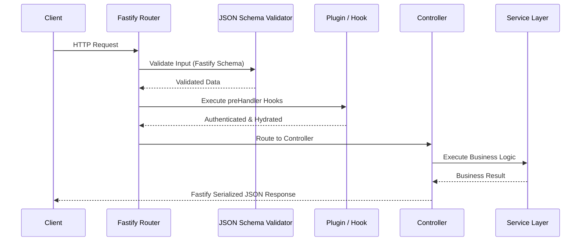

<div align="center">
  

  # 🚀 Fastify Production-Ready Best Practices
</div>
---

This document outlines the **best practices** for Fastify architecture. Fastify focuses on extreme performance and strict schema-based validation. Strict adherence to these rules is critical for maintaining the efficiency and security of enterprise code.

# Context & Scope
- **Primary Goal:** Provide a strict architectural framework and patterns for creating high-performance secure Fastify APIs.
- **Target Tooling:** AI agents (Cursor, Windsurf, Copilot) and Senior Developers.
- **Tech Stack Version:** Fastify 4.x / 5.x

> [!IMPORTANT]
> **Architectural Contract:** MUST strictly utilize Fastify's built-in JSON Schema validation for all incoming requests. DO NOT rely on generic middleware for data shaping.
---

## 📑 Specialized Documentation

- [Architecture](./architecture.md)

## 🔄 Architecture Data Flow



## 🚨 1. Schema Validation Bypass
### ❌ Bad Practice
```typescript
fastify.post('/users', async (request, reply) => {
  const { username, age } = request.body as unknown; // No schema validation
  if (!username) throw new Error('Missing username');
  // Manual, error-prone validation...
  return { success: true };
});
```
### ⚠️ Problem
Failing to utilize Fastify's native JSON schema compiler bypasses the framework's core performance optimizations and exposes the application to malformed data injection. Manual validation is error-prone and non-deterministic.
### ✅ Best Practice
```typescript
const userSchema = {
  body: {
    type: 'object',
    required: ['username', 'age'],
    properties: {
      username: { type: 'string' },
      age: { type: 'number' }
    }
  }
};

fastify.post('/users', { schema: userSchema }, async (request, reply) => {
  // request.body is strictly validated and typesafe at runtime
  return { success: true, user: request.body.username };
});
```

> [!NOTE]
> **Internal Routing:** For more context, refer back to the [Global Index](../README.md).

### 🚀 Solution
MANDATORY: Define a JSON schema for `body`, `querystring`, `params`, and `headers` on every single route definition to ensure deterministic type safety and maximum throughput.
