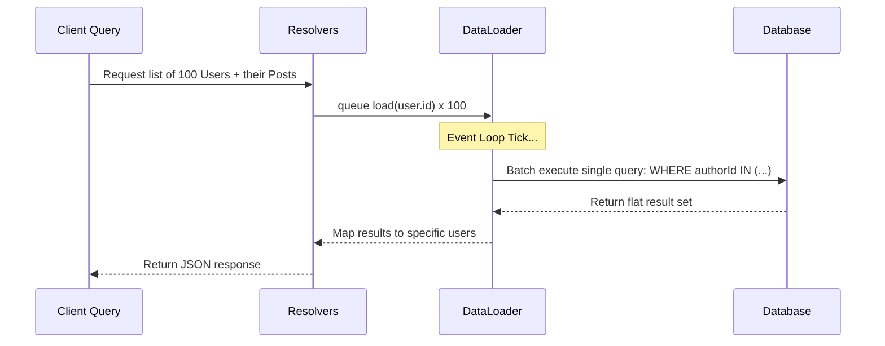

<div align="center">
  

  # 🕸️ GraphQL Production-Ready Best Practices
</div>
---

This document establishes **best practices** for building and maintaining GraphQL APIs. These constraints guarantee a scalable, highly secure, and deterministic architecture suitable for an enterprise-level, production-ready backend.
# ⚙️ Context & Scope
- **Primary Goal:** Provide an uncompromising set of rules and architectural constraints for GraphQL API environments.
- **Target Tooling:** AI-agents (Cursor, Windsurf, Copilot, Antigravity) and Senior Developers.
- **Tech Stack Version:** Agnostic

> [!IMPORTANT]
> **Architectural Contract:** Implement robust query depth limiting, strict input validation, and use DataLoader for mitigating N+1 query problems. Never expose unstructured data directly from resolvers.
---
## 📑 Specialized Documentation

- [Security Best Practices](./security-best-practices.md)
- [Architecture](./architecture.md)

## 🏗️ Architecture & Component Isolation

### 📊 DataLoader Orchestration Process




## 🚨 1. Resolving the N+1 Query Problem
### ❌ Bad Practice
```javascript
// A resolver fetching a related entity synchronously inside a loop
const resolvers = {
  User: {
    posts: async (user, args, context) => {
      // Executes a separate database query for EVERY user fetched
      return await db.posts.find({ authorId: user.id });
    }
  }
};
```
### ⚠️ Problem
Fetching associated records one by one within a list resolver results in the N+1 problem, overwhelming the database with redundant queries, leading to severe performance degradation.
### ✅ Best Practice
```javascript
// Utilizing DataLoader to batch and cache database requests
const resolvers = {
  User: {
    posts: async (user, args, { loaders }) => {
      // Batches all authorIds and executes a single IN query
      return await loaders.postsByAuthorId.load(user.id);
    }
  }
};
```
### 🚀 Solution
Strictly utilize a batching utility like `DataLoader` for resolving all one-to-many or many-to-many relationships. This guarantees that deep GraphQL queries are translated into optimized, batched SQL/NoSQL queries.

---

[Back to Top](#)


Explore advanced architectural topics for GraphQL:
