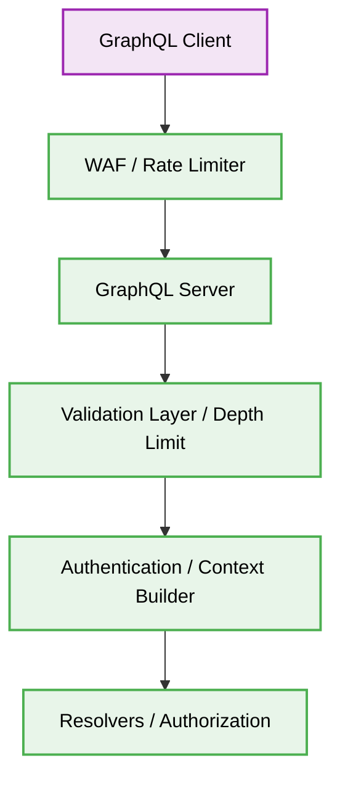

# 🔒 GraphQL Security Best Practices


## 1. 🛑 Query Depth & Complexity Limiting
### ❌ Bad Practice
```javascript
// Accepting unbounded GraphQL queries
const server = new ApolloServer({
  schema,
  // No depth or complexity limits applied
});
```
### ⚠️ Problem
Without depth or complexity limits, an attacker can craft a deeply nested query (e.g., requesting `user -> friends -> user -> friends` recursively) causing catastrophic Resource Exhaustion (DoS) on the server and database.
### ✅ Best Practice
```javascript
// Implementing Query Depth Limit
import depthLimit from 'graphql-depth-limit';

const server = new ApolloServer({
  schema,
  validationRules: [depthLimit(5)], // Restrict nesting to 5 levels
});
```
### 🚀 Solution
Strictly enforce a Query Depth Limit. Additionally, implement Query Complexity Analysis (assigning weights to specific fields) to reject overly expensive queries before they are executed.

## 2. 🗂️ Architectural Workflow


