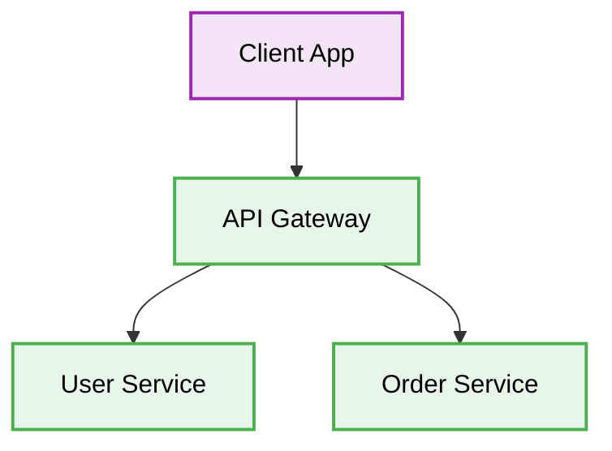

# 🧩 Microservices API Design

[⬅️ Back to Parent](./readme.md)


## 1. 🛑 Direct Service-to-Client Exposure
### ❌ Bad Practice
```javascript
// Client talks directly to multiple microservices
fetch('http://user-service:3000/users');
fetch('http://order-service:4000/orders');
```
### ⚠️ Problem
Exposing individual microservices directly to clients creates security risks, forces the client to handle aggregation, and makes API versioning difficult.
### ✅ Best Practice
```javascript
// Client talks to API Gateway
fetch('https://api.example.com/graphql');
```

> [!NOTE]
> **Internal Routing:** For more context, refer back to the [Microservices Index](./readme.md).

### 🚀 Solution
Implement an API Gateway or Backend-for-Frontend (BFF) pattern to act as a single entry point, handle cross-cutting concerns (auth, rate limiting), and aggregate responses.

## 2. 🗂️ Architectural Workflow


