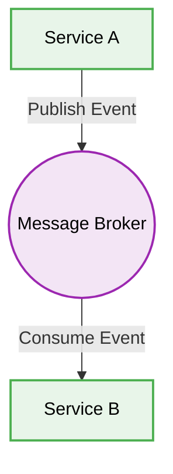

# 🧩 Microservices Architecture

[⬅️ Back to Parent](./readme.md)


## 1. 🛑 Synchronous Communication Bottlenecks
### ❌ Bad Practice
```javascript
// Service A waits synchronously for Service B
const result = await axios.get('http://service-b/data');
```
### ⚠️ Problem
Synchronous chains across microservices create tight coupling and cascading failures. If one service is slow, the entire request chain slows down or times out.
### ✅ Best Practice
```javascript
// Event-driven asynchronous communication
await messageBroker.publish('OrderCreated', orderData);
```
### 🚀 Solution
Favor asynchronous event-driven communication (e.g., using Kafka, RabbitMQ, or AWS SNS/SQS) to decouple services and improve overall system resilience.

## 2. 🗂️ Architectural Workflow


