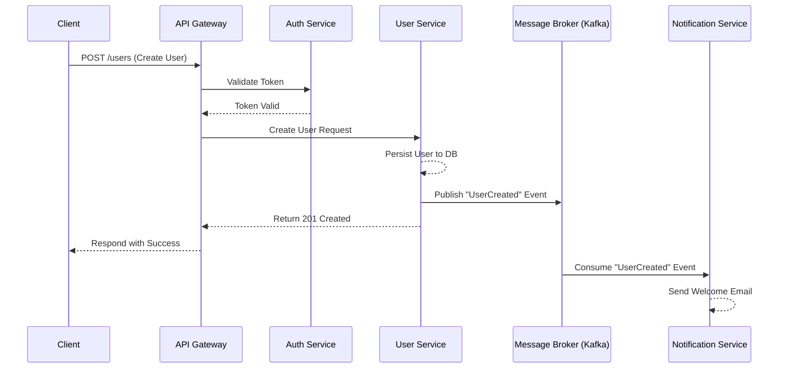

  

  # 🧩 Microservices Production-Ready Best Practices

---

This document establishes **best practices** for designing and maintaining a Microservices architecture. These constraints guarantee a scalable, highly secure, and clean system suitable for an enterprise-level, production-ready backend.

# ⚙️ Context & Scope
- **Primary Goal:** Provide an uncompromising set of rules and architectural constraints for distributed system environments.
- **Target Tooling:** AI-agents (Cursor, Windsurf, Copilot, Antigravity) and System Architects.
- **Tech Stack Version:** Agnostic

> [!IMPORTANT]
> **Architectural Standard (Contract):** Ensure loose coupling and high cohesion. Each microservice must own its domain data. Use asynchronous messaging (e.g., Kafka, RabbitMQ) for inter-service communication to prevent cascading failures.

---

## 🏗️ 1. Architecture & Design

### Domain-Driven Design (DDD)
- Define clear Bounded Contexts for every service to avoid spaghetti dependencies.
- Implement the API Gateway pattern to route external requests to internal microservices, handling cross-cutting concerns (auth, rate limiting).

### 🔄 Data Flow Lifecycle

## 🔒 2. Security Best Practices

### Service-to-Service Authentication
- Implement Zero Trust architecture. Internal services must authenticate each other using mTLS (Mutual TLS) or signed JWTs.
- Secrets must never be hardcoded. Utilize a secret manager (HashiCorp Vault, AWS Secrets Manager).

### Data Isolation
- Enforce "Database per Service" pattern. Services must never share a single database to ensure independent scaling and deployment.

## 🚀 3. Reliability Optimization

### Resilience Patterns
- Implement Circuit Breakers (e.g., resilience4j) to fail fast and recover when a dependent service goes down.
- Implement retries with exponential backoff for transient network errors.
- Ensure Idempotency for critical operations to handle duplicated requests gracefully.

### Observability
- Distributed Tracing is mandatory (OpenTelemetry). All requests must pass a Correlation ID across service boundaries.
- Centralized Logging (ELK, Datadog) is required for debugging complex distributed issues.

## 📚 Specialized Documentation
- [architecture.md](./architecture.md)
- [security-best-practices.md](./security-best-practices.md)
- [api-design.md](./api-design.md)

---

[Back to Top](#)
