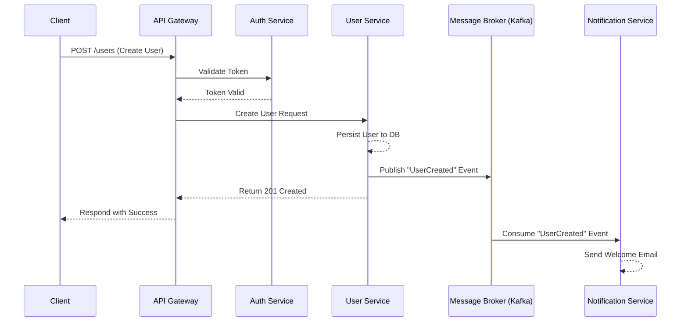

<div align="center">
  

  # 🧩 Microservices Production-Ready Best Practices
</div>
---

> [!IMPORTANT]
> This document establishes **best practices** for designing and maintaining a Microservices architecture. These constraints guarantee a scalable, highly secure, and deterministic system suitable for an enterprise-level, production-ready backend.
# ⚙️ Context & Scope
- **Primary Goal:** Provide an uncompromising set of rules and architectural constraints for distributed system environments.
- **Target Tooling:** AI-agents (Cursor, Windsurf, Copilot, Antigravity) and System Architects.
- **Tech Stack Version:** Agnostic

> [!IMPORTANT]
> **Architectural Standard (Contract):** Ensure loose coupling and high cohesion. Each microservice must own its domain data. Use asynchronous messaging (e.g., Kafka, RabbitMQ) for inter-service communication to prevent cascading failures.
---
## 🏗️ 1. Architecture & Design

### Domain-Driven Design (DDD)
### ❌ Bad Practice
```typescript
// Spaghetti dependencies: User Service directly importing Database Context of Order Service
import { OrderRepository } from '@services/orders/repository';

export class UserService {
  constructor(private orderRepo: OrderRepository) {}
  async deleteUser(userId: string) {
    await this.orderRepo.deleteByUserId(userId); // Tight coupling across domain boundaries
  }
}
```
### ⚠️ Problem
Directly accessing another service's database or internal modules breaks Bounded Contexts. It creates a tightly coupled monolithic architecture under the guise of microservices, making independent deployments impossible and cascading failures common.
### ✅ Best Practice
```typescript
// Event-driven decoupled architecture using a Message Broker
export class UserService {
  constructor(private eventEmitter: MessageBrokerClient) {}
  async deleteUser(userId: string) {
    await this.userRepo.delete(userId);
    // Publish domain event instead of direct deletion
    await this.eventEmitter.publish('UserDeleted', { userId });
  }
}
```

> [!NOTE]
> **Internal Routing:** For more context, refer back to the [Backend Index](../readme.md).

### 🚀 Solution
Define clear Bounded Contexts. Services must own their data and logic. Use asynchronous events to communicate state changes across domains. Implement the API Gateway pattern to handle cross-cutting concerns (auth, routing).

### 🔄 Data Flow Lifecycle


```mermaid
sequenceDiagram
    participant Client
    participant Gateway as API Gateway
    participant Auth as Auth Service
    participant User as User Service
    participant Msg as Message Broker (Kafka)
    participant Notification as Notification Service

    Client->>Gateway: POST /users (Create User)
    Gateway->>Auth: Validate Token
    Auth-->>Gateway: Token Valid
    Gateway->>User: Create User Request
    User-->>User: Persist User to DB
    User->>Msg: Publish "UserCreated" Event
    User-->>Gateway: Return 201 Created
    Gateway-->>Client: Respond with Success

    Msg->>Notification: Consume "UserCreated" Event
    Notification-->>Notification: Send Welcome Email
```
## 🔒 2. Security Best Practices

### Service-to-Service Authentication
### ❌ Bad Practice
```typescript
// Assuming internal network is secure and sending requests unauthenticated
const response = await axios.post(`http://order-service/orders`, orderData);
```
### ⚠️ Problem
Implicit trust within internal networks enables a compromised container to move laterally and attack other services, leading to catastrophic privilege escalation. Hardcoded credentials compound this vulnerability.
### ✅ Best Practice
```typescript
// Using short-lived signed JWTs or mTLS for service communication
const token = await authService.generateServiceToken('order-service');
const response = await axios.post(`https://order-service/orders`, orderData, {
  headers: { Authorization: `Bearer ${token}` }
});
```
### 🚀 Solution
Implement Zero Trust architecture. Internal services must authenticate each other using mTLS (Mutual TLS) or cryptographically signed JWTs. Never hardcode secrets; instead, utilize a secret manager (e.g., HashiCorp Vault, AWS Secrets Manager).

### Data Isolation
### ❌ Bad Practice
```yaml
# docker-compose.yml
services:
  user-service:
    environment:
      - DB_URL=postgres://shared-db:5432/monolith_db
  order-service:
    environment:
      - DB_URL=postgres://shared-db:5432/monolith_db # Shared database anti-pattern
```
### ⚠️ Problem
Sharing a single database across multiple microservices leads to schema coupling. If the User Service alters a table, the Order Service crashes. It defeats the purpose of independent scaling and creates a single point of failure (SPOF).
### ✅ Best Practice
```yaml
# docker-compose.yml
services:
  user-service:
    environment:
      - DB_URL=postgres://user-db:5432/users
  order-service:
    environment:
      - DB_URL=postgres://order-db:5432/orders # Independent database
```
### 🚀 Solution
Enforce the "Database per Service" pattern. Services must never share a single database or directly query another service's tables. Ensure independent scaling, deployment, and technology choices per domain.
## 🚀 3. Reliability Optimization

### Resilience Patterns
### ❌ Bad Practice
```typescript
// Synchronous HTTP call without timeout or fallback
async function getUserData(userId: string) {
  // If user-service is slow or down, this request hangs and blocks threads
  const response = await axios.get(`http://user-service/users/${userId}`);
  return response.data;
}
```
### ⚠️ Problem
Relying on direct synchronous HTTP calls between microservices without fallbacks creates a fragile system. If one service experiences a delay, it consumes threads on the caller, eventually leading to a cascading failure across the entire cluster.
### ✅ Best Practice
```typescript
// Resilience4j or similar Circuit Breaker implementation
const circuitBreaker = new CircuitBreaker(getUserData, {
  timeout: 3000,
  errorThresholdPercentage: 50,
  resetTimeout: 30000
});

async function safeGetUserData(userId: string) {
  try {
    return await circuitBreaker.fire(userId);
  } catch (error) {
    return { status: 'fallback', message: 'User service unavailable' }; // Fallback strategy
  }
}
```
#### 🚀 Solution
> [!IMPORTANT]
> Implement Circuit Breakers to fail O(1) or O(n) complexity and prevent resource exhaustion. Use retries with exponential backoff for transient errors, and ensure idempotency for critical API endpoints to handle duplicated requests safely.

### Observability
### ❌ Bad Practice
```typescript
// Logging without correlation context
console.log('Order processed successfully');
```
### ⚠️ Problem
When an error spans multiple services, isolated logs lacking a unique identifier make tracing the original request path nearly impossible, drastically increasing debugging time during critical outages.
### ✅ Best Practice
```typescript
// Implementing OpenTelemetry and passing a Correlation ID
import { context, trace } from '@opentelemetry/api';

const span = trace.getTracer('default').startSpan('ProcessOrder');
logger.info('Order processed successfully', {
  traceId: span.spanContext().traceId,
  orderId: order.id
});
span.end();
```
### 🚀 Solution
Distributed Tracing is mandatory (e.g., using OpenTelemetry). All requests must pass a Correlation ID (Trace ID) across service boundaries. Centralized Logging (ELK, Datadog) is required for correlating complex distributed issues.
---

[Back to Top](#)


Explore advanced architectural topics for Microservices:

## 📑 Specialized Documentation

- [Security Best Practices](./security-best-practices.md)
- [Architecture](./architecture.md)
- [Api Design](./api-design.md)
