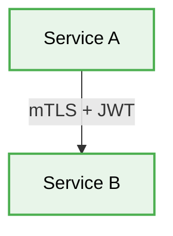

# 🧩 Microservices Security Best Practices

[⬅️ Back to Parent](./readme.md)


## 1. 🛑 Implicit Trust Between Services
### ❌ Bad Practice
```javascript
// Service A trusts Service B without strictly validating
app.post('/internal/process', (req, res) => {
    // Process without checking authorization
});
```
### ⚠️ Problem
Assuming the internal network is secure (Zero Trust violation) means if one service is compromised, the attacker has unrestricted access to the entire cluster.
### ✅ Best Practice
```javascript
// Using mutual TLS (mTLS) and passing JWTs
app.post('/internal/process', verifyJwt, (req, res) => {
    // Process after validation
});
```

> [!NOTE]
> **Internal Routing:** For more context, refer back to the [Microservices Index](./readme.md).

### 🚀 Solution
Implement the Zero Trust architecture. Use mutual TLS (mTLS) for service-to-service communication and forward identity context (e.g., JWTs) downstream.

## 2. 🗂️ Architectural Workflow


