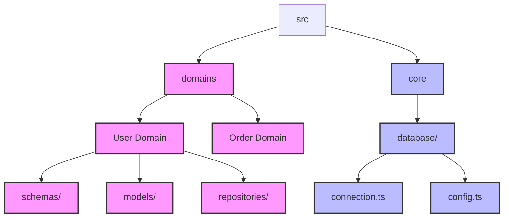
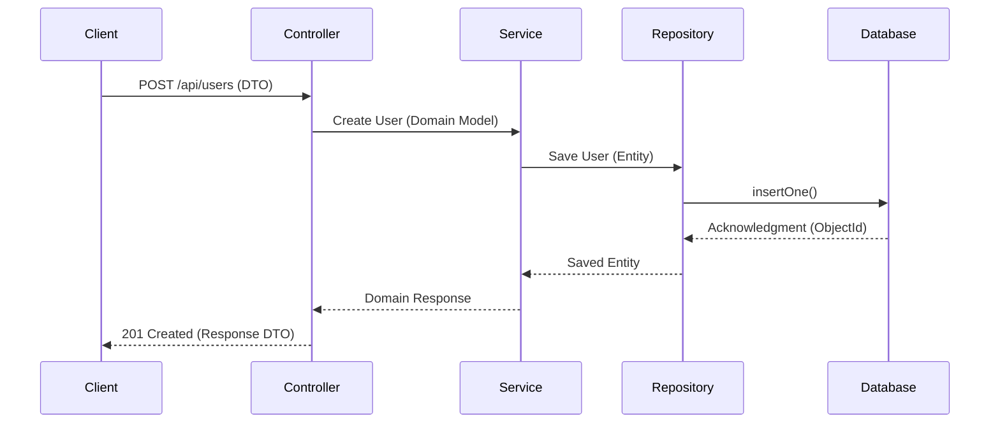
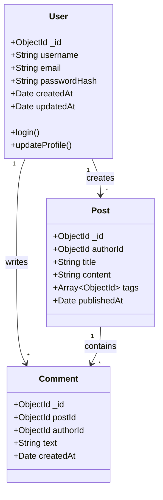

# 🏛️ MongoDB Architecture Constraints

This document provides the "executable blueprints" for MongoDB architecture, outlining folder hierarchies, request/data flows, and entity relationships to ensure AI-agent readiness.

## 📂 Folder Hierarchy Constraints

## 🔄 Request / Data Flow

## 🔗 Entity Relationships

---

[⬆ Back to Top](#-mongodb-architecture-constraints)
