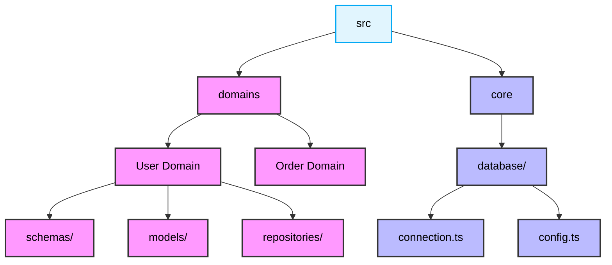
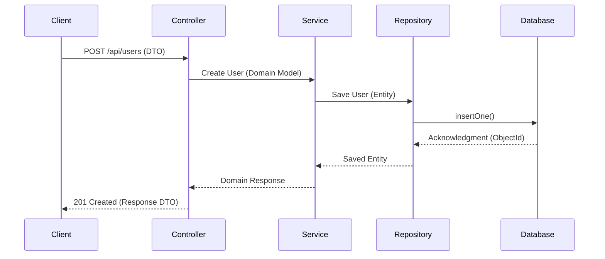
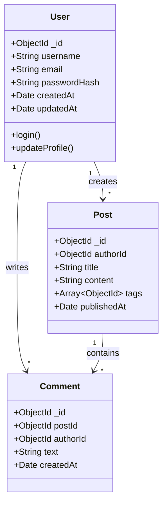
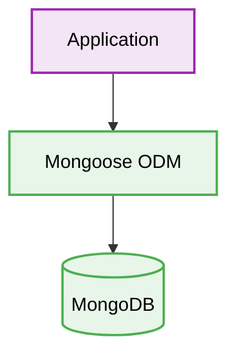

# 🏛️ MongoDB Architecture Constraints

[⬅️ Back to Parent](./readme.md)

This document provides the "executable blueprints" for MongoDB architecture, outlining folder hierarchies, request/data flows, and entity relationships to ensure AI-agent readiness.
## 📂 Folder Hierarchy Constraints


```mermaid
graph TD
  classDef domain fill:#f9f,stroke:#333,stroke-width:2px;
  classDef core fill:#bbf,stroke:#333,stroke-width:2px;

  src[src] --> domains[domains]
  src --> core[core]

  domains --> user[User Domain]
  domains --> order[Order Domain]

  user --> schemas[schemas/]
  user --> models[models/]
  user --> repositories[repositories/]

  core --> database[database/]
  database --> connection[connection.ts]
  database --> config[config.ts]

  class domains,user,order,schemas,models,repositories domain;
  class core,database,connection,config core;

    classDef default fill:#e1f5fe,stroke:#03a9f4,stroke-width:2px,color:#000;
    classDef component fill:#e8f5e9,stroke:#4caf50,stroke-width:2px,color:#000;
```
## 🔄 Request / Data Flow


```mermaid
sequenceDiagram
    participant Client
    participant Controller
    participant Service
    participant Repository
    participant Database

    Client->>Controller: POST /api/users (DTO)
    Controller->>Service: Create User (Domain Model)
    Service->>Repository: Save User (Entity)
    Repository->>Database: insertOne()
    Database-->>Repository: Acknowledgment (ObjectId)
    Repository-->>Service: Saved Entity
    Service-->>Controller: Domain Response
    Controller-->>Client: 201 Created (Response DTO)
```
## 🔗 Entity Relationships


```mermaid
classDiagram
    class User {
        +ObjectId _id
        +String username
        +String email
        +String passwordHash
        +Date createdAt
        +Date updatedAt
        +login()
        +updateProfile()
    }

    class Post {
        +ObjectId _id
        +ObjectId authorId
        +String title
        +String content
        +Array~ObjectId~ tags
        +Date publishedAt
    }

    class Comment {
        +ObjectId _id
        +ObjectId postId
        +ObjectId authorId
        +String text
        +Date createdAt
    }

    User "1" --> "*" Post : creates
    User "1" --> "*" Comment : writes
    Post "1" --> "*" Comment : contains
```
---

[⬆ Back to Top](#-mongodb-architecture-constraints)

## 1. 🛑 Schema-less Anti-pattern
### ❌ Bad Practice
```javascript
// Inserting whatever object properties exist
db.collection('users').insertOne({ anything: "goes", random: 123 });
```
### ⚠️ Problem
Treating MongoDB as completely schema-less leads to data inconsistencies, corrupted application logic, and complex migrations down the line.
### ✅ Best Practice
```javascript
// Using JSON Schema validation at the database level or an ODM like Mongoose
const userSchema = new mongoose.Schema({
  email: { type: String, required: true },
  age: { type: Number, min: 18 }
});
const User = mongoose.model('User', userSchema);
```

> [!NOTE]
> **Internal Routing:** For more context, refer back to the [Mongodb Index](./readme.md).

### 🚀 Solution
Enforce structural constraints either via MongoDB's native JSON Schema validation or using an Object Data Modeling (ODM) library.

## 2. 🗂️ Architectural Workflow


```mermaid
graph TD
    A[Application] --> B[Mongoose ODM]
    B --> C[(MongoDB)]

    classDef default fill:#e1f5fe,stroke:#03a9f4,stroke-width:2px,color:#000;
    classDef component fill:#e8f5e9,stroke:#4caf50,stroke-width:2px,color:#000;
    classDef layout fill:#f3e5f5,stroke:#9c27b0,stroke-width:2px,color:#000;

    class A layout;
    class B component;
    class C component;
```
