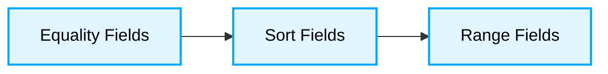

# ⚡ MongoDB Database Optimization Best Practices

[⬅️ Back to Parent](./readme.md)

This document outlines indexing strategies (ESR Rule), aggregation pipeline optimization, and query tuning for enterprise-grade MongoDB environments.
## 🎯 1. The ESR (Equality, Sort, Range) Rule

When designing indexes, always follow the ESR rule to maximize efficiency.

### ❌ Bad Practice

Creating indexes randomly without understanding the query patterns.

```javascript
// A query with equality, sort, and range:
// db.orders.find({ status: "shipped", amount: { $gt: 100 } }).sort({ date: 1 })

// Bad index - Range comes before Sort
db.orders.createIndex({ status: 1, amount: 1, date: 1 })
```

### ⚠️ Problem

Creating indexes in a suboptimal order (e.g., Range before Sort) forces MongoDB to scan unnecessary index keys or perform in-memory sorts, drastically degrading query throughput and blocking execution threads under high load.

### ✅ Best Practice

Create indexes following the ESR rule:
1.  **E**quality fields first.
2.  **S**ort fields next.
3.  **R**ange fields last.



### 🚀 Solution

```javascript
// Ideal index for the ESR query
db.orders.createIndex({ status: 1, date: 1, amount: 1 })
```
---
## 🏗️ 2. Aggregation Pipeline Optimization

Pipelines process documents in stages. Optimizing the order of these stages dramatically improves performance.

### ❌ Bad Practice

Filtering data after heavy transformations or sorting large un-indexed datasets.

```javascript
db.users.aggregate([
  { $project: { name: 1, age: 1, status: 1 } },
  { $sort: { age: -1 } },
  { $match: { status: "active" } }
])
```

### ⚠️ Problem

Filtering data after heavy memory-intensive operations (like large sorts or projections) wastes computational resources and memory, blocking the event loop and drastically degrading aggregation pipeline performance.

### ✅ Best Practice

Always use `$match` and `$sort` as early as possible in the pipeline to reduce the working set and take advantage of indexes. Use `$project` later.

### 🚀 Solution

```javascript
db.users.aggregate([
  { $match: { status: "active" } },
  { $sort: { age: -1 } },
  { $project: { name: 1, age: 1 } }
])
```
---
## 📉 3. Covered Queries

A covered query is a query that WILL be satisfied entirely using an index, without having to examine the actual documents.

### ❌ Bad Practice

```javascript
// A query that fetches the entire document when only a few fields are needed
// If an index exists on { status: 1 }, this query still needs to fetch the document to get the amount
db.orders.find({ status: "shipped" })
```

### ⚠️ Problem

Fetching entire documents when only a subset of fields is required causes unnecessary disk I/O and memory usage. This leads to slower query performance and reduced database throughput, especially under high concurrency.

### ✅ Best Practice

```javascript
// Create a compound index that covers the query
db.orders.createIndex({ status: 1, amount: 1 })
```

### 🚀 Solution

If you have an index on `{ status: 1, amount: 1 }`:

```javascript
// This is a covered query because it only projects indexed fields (and explicitly excludes _id)
db.orders.find(
  { status: "shipped" },
  { status: 1, amount: 1, _id: 0 }
)
```
---

[⬆ Back to Top](#-mongodb-database-optimization-best-practices)
