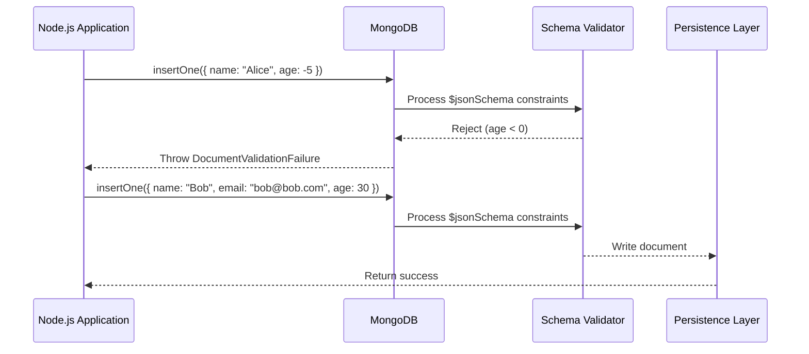

<div align="center">
  

  # 🍃 MongoDB Production-Ready Best Practices
</div>
---

This document establishes **best practices** for building and maintaining MongoDB databases. These constraints guarantee a scalable, highly secure, and deterministic architecture suitable for an enterprise-level, production-ready backend.
# ⚙️ Context & Scope
- **Primary Goal:** Provide an uncompromising set of rules and architectural constraints for MongoDB environments.
- **Target Tooling:** AI-agents (Cursor, Windsurf, Copilot, Antigravity) and Senior Database Administrators.
- **Tech Stack Version:** MongoDB 7.0+

> [!IMPORTANT]
> **Architectural Contract:** MongoDB is schema-less by nature, but production applications require strict schema validation at the database level and through ORM/ODMs like Mongoose. Never allow unstructured data to enter the persistence layer without validation.
---


---
## 🏗️ Core Principles

### 📊 Schema Validation Lifecycle




## 📑 Specialized Documentation

- [Database Optimization](./database-optimization.md)
- [Security Best Practices](./security-best-practices.md)
- [Architecture](./architecture.md)

## 🚨 1. Schema Validation
### ❌ Bad Practice
```javascript
// Inserting data without validation
db.users.insertOne({ name: "John", age: -5, admin: true });
```
### ⚠️ Problem
Failing to follow best practices for `schema validation` tightly couples dependencies and degrades predictability. This unstructured approach deviates from deterministic AI-coding standards, creating severe architectural debt and potential security vulnerabilities in enterprise scaling.
### ✅ Best Practice
Implement strict schema validation using JSON Schema in MongoDB.

> [!NOTE]
> **Internal Routing:** For more context, refer back to the [Backend Index](../readme.md).

### 🚀 Solution
```javascript
db.createCollection("users", {
  validator: {
    $jsonSchema: {
      bsonType: "object",
      required: ["name", "email"],
      properties: {
        name: {
          bsonType: "string",
          description: "must be a string and is required"
        },
        email: {
          bsonType: "string",
          pattern: "^.+@.+\\..+$",
          description: "must be a valid email and is required"
        },
        age: {
          bsonType: "int",
          minimum: 0,
          description: "must be an integer greater than or equal to 0"
        }
      }
    }
  }
});
```


---

[⬆ Back to Top](#-mongodb-production-ready-best-practices)


Explore advanced architectural topics for MongoDB:
