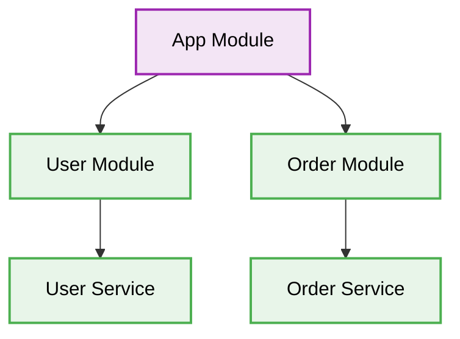

# 🏗️ NestJS 11+ Architecture Best Practices

[⬅️ Back to Parent](./readme.md)


## 1. 🛑 Tightly Coupled Modules
### ❌ Bad Practice
```typescript
@Module({
  imports: [],
  controllers: [UserController, OrderController],
  providers: [UserService, OrderService],
})
export class AppModule {}
```
### ⚠️ Problem
Placing unrelated domains in the root module creates a monolith that is hard to maintain, scale, and test independently.
### ✅ Best Practice
```typescript
@Module({
  imports: [UserModule, OrderModule],
})
export class AppModule {}
```

### 🚀 Solution
Adopt Domain-Driven Design (DDD). Encapsulate domain logic within feature modules to ensure low coupling and high cohesion.

## 2. 🗂️ Architectural Workflow


