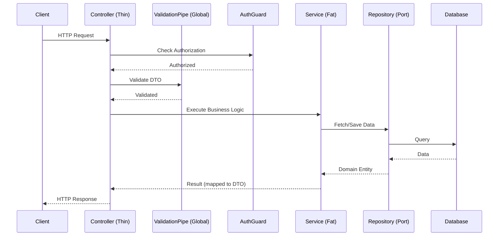

<div align="center">
  
  
  # 🦁 NestJS Production-Ready Best Practices
</div>
---

This document defines the **best practices** for the NestJS framework. The guide is designed to ensure scalability, security, and the quality of Enterprise applications.
## 🎯 Context & Scope
- **Primary Goal:** Provide strict architectural rules and 30 development patterns for NestJS.
- **Target Tooling:** AI agents (Cursor, Windsurf, Copilot) and Senior Developers.
- **Tech Stack Version:** NestJS 11+

> [!IMPORTANT]
> **Architectural Contract:** Use strict TypeScript typing, DI (Dependency Injection), and a modular structure. Business logic must be isolated from HTTP layer details and databases.
---

## 📑 Specialized Documentation

- [Security Best Practices](./security-best-practices.md)
- [Architecture](./architecture.md)

## 🔄 Architecture Data Flow



---
### 🚨 1. Clean Architecture Modules (Logic Isolation)
#### ❌ Bad Practice
```typescript
@Injectable()
export class UsersService {
  constructor(@InjectRepository(User) private repo: Repository<User>) {} // Tight coupling to TypeORM
}
```
#### ⚠️ Problem
Failing to follow best practices for `clean architecture modules` tightly couples dependencies and degrades predictability. This unstructured approach deviates from deterministic AI-coding standards, creating severe architectural debt and potential security vulnerabilities in enterprise scaling.
#### ✅ Best Practice
```typescript
@Injectable()
export class UsersService {
  constructor(@Inject('IUserRepository') private repo: IUserRepository) {} // Port interface
}
```
#### 🚀 Solution
Apply Dependency Inversion. Business logic MUST depend on abstractions (interfaces), not on specific ORMs.

### 🚨 2. Global ValidationPipe
#### ❌ Bad Practice
```typescript
@Post()
create(@Body() dto: CreateUserDto) {
  if (!dto.email) throw new BadRequestException('Email required');
}
```
#### ⚠️ Problem
Failing to follow best practices for `global validationpipe` tightly couples dependencies and degrades predictability. This unstructured approach deviates from deterministic AI-coding standards, creating severe architectural debt and potential security vulnerabilities in enterprise scaling.
#### ✅ Best Practice
```typescript
// main.ts
app.useGlobalPipes(new ValidationPipe({ whitelist: true, forbidNonWhitelisted: true }));
```
#### 🚀 Solution
Enable global validation based on `class-validator` and `whitelist` to automatically strip unknown fields.

### 🚨 3. Data Transfer Objects (DTO)
#### ❌ Bad Practice
```typescript
@Post()
create(@Body() body: unknown) {} // Loss of typing
```
#### ⚠️ Problem
Failing to follow best practices for `data transfer objects (dto)` tightly couples dependencies and degrades predictability. This unstructured approach deviates from deterministic AI-coding standards, creating severe architectural debt and potential security vulnerabilities in enterprise scaling.
#### ✅ Best Practice
```typescript
export class CreateUserDto {
  @IsEmail()
  email: string;
}
@Post()
create(@Body() dto: CreateUserDto) {}
```
#### 🚀 Solution
All client data MUST be strictly described using DTOs with validation decorators.

### 🚨 4. Fat Controllers vs Thin Controllers
#### ❌ Bad Practice
```typescript
@Post()
async createUser(@Body() dto: CreateDto) {
  const hash = await bcrypt.hash(dto.password, 10);
  return this.db.users.create({ ...dto, hash });
}
```
#### ⚠️ Problem
Failing to follow best practices for `fat controllers vs thin controllers` tightly couples dependencies and degrades predictability. This unstructured approach deviates from deterministic AI-coding standards, creating severe architectural debt and potential security vulnerabilities in enterprise scaling.
#### ✅ Best Practice
```typescript
@Post()
async createUser(@Body() dto: CreateDto) {
  return this.userService.register(dto);
}
```
#### 🚀 Solution
Controllers ONLY route requests. All business logic MUST reside in the Service Layer.

### 🚨 5. Global Exception Filter
#### ❌ Bad Practice
```typescript
try { ... } catch (e) { throw new HttpException('Error', 500); }
```
#### ⚠️ Problem
Failing to follow best practices for `global exception filter` tightly couples dependencies and degrades predictability. This unstructured approach deviates from deterministic AI-coding standards, creating severe architectural debt and potential security vulnerabilities in enterprise scaling.
#### ✅ Best Practice
```typescript
@Catch()
export class AllExceptionsFilter implements ExceptionFilter {
  catch(exception: unknown, host: ArgumentsHost) { /* Unified error format */ }
}
// main.ts
app.useGlobalFilters(new AllExceptionsFilter());
```
#### 🚀 Solution
Use Exception Filters to standardize the format of all HTTP API errors.

### 🚨 6. Async Module Configuration
#### ❌ Bad Practice
```typescript
TypeOrmModule.forRoot({ url: process.env.DB_URL }) // Variables might not be loaded yet
```
#### ⚠️ Problem
Failing to follow best practices for `async module configuration` tightly couples dependencies and degrades predictability. This unstructured approach deviates from deterministic AI-coding standards, creating severe architectural debt and potential security vulnerabilities in enterprise scaling.
#### ✅ Best Practice
```typescript
TypeOrmModule.forRootAsync({
  imports: [ConfigModule],
  useFactory: (config: ConfigService) => ({ url: config.get('DB_URL') }),
  inject: [ConfigService],
})
```
#### 🚀 Solution
For third-party modules, always use `forRootAsync` / `registerAsync` to safely inject configurations.

### 🚨 7. Configuration Management
#### ❌ Bad Practice
```typescript
const secret = process.env.JWT_SECRET; // Direct access
```
#### ⚠️ Problem
Failing to follow best practices for `configuration management` tightly couples dependencies and degrades predictability. This unstructured approach deviates from deterministic AI-coding standards, creating severe architectural debt and potential security vulnerabilities in enterprise scaling.
#### ✅ Best Practice
```typescript
constructor(private configService: ConfigService) {}
const secret = this.configService.get<string>('JWT_SECRET');
```
#### 🚀 Solution
Use `@nestjs/config` for safe, strongly-typed extraction of environment variables.

### 🚨 8. Custom Decorators (User Extraction)
#### ❌ Bad Practice
```typescript
@Get()
getProfile(@Req() req: Request) { return req.user; }
```
#### ⚠️ Problem
Failing to follow best practices for `custom decorators` tightly couples dependencies and degrades predictability. This unstructured approach deviates from deterministic AI-coding standards, creating severe architectural debt and potential security vulnerabilities in enterprise scaling.
#### ✅ Best Practice
```typescript
export const CurrentUser = createParamDecorator((data, ctx: ExecutionContext) => ctx.switchToHttp().getRequest().user);

@Get()
getProfile(@CurrentUser() user: UserEntity) { return user; }
```
#### 🚀 Solution
Create custom decorators for clean data extraction from the Request (e.g., the current user).

### 🚨 9. JWT Guards (Route Protection)
#### ❌ Bad Practice
```typescript
@Get()
getData(@Req() req) { if (!req.headers.auth) throw new UnauthorizedException(); }
```
#### ⚠️ Problem
Failing to follow best practices for `jwt guards` tightly couples dependencies and degrades predictability. This unstructured approach deviates from deterministic AI-coding standards, creating severe architectural debt and potential security vulnerabilities in enterprise scaling.
#### ✅ Best Practice
```typescript
@UseGuards(JwtAuthGuard)
@Get()
getData() {}
```
#### 🚀 Solution
Authorization MUST occur before the controller via Guards (e.g., Passport JWT strategy).

### 🚨 10. Role-Based Access Control (RBAC)
#### ❌ Bad Practice
```typescript
@Get()
getAdminData(@CurrentUser() user) { if (user.role !== 'ADMIN') throw new ForbiddenException(); }
```
#### ⚠️ Problem
Failing to follow best practices for `role-based access control (rbac)` tightly couples dependencies and degrades predictability. This unstructured approach deviates from deterministic AI-coding standards, creating severe architectural debt and potential security vulnerabilities in enterprise scaling.
#### ✅ Best Practice
```typescript
@Roles('ADMIN')
@UseGuards(JwtAuthGuard, RolesGuard)
@Get()
getAdminData() {}
```
#### 🚀 Solution
Use custom role decorators (`@Roles`) and `RolesGuard` for declarative access control.

### 🚨 11. Built-in Pipes for Transformation
#### ❌ Bad Practice
```typescript
@Get(':id')
getUser(@Param('id') id: string) { const userId = parseInt(id, 10); }
```
#### ⚠️ Problem
Failing to follow best practices for `built-in pipes for transformation` tightly couples dependencies and degrades predictability. This unstructured approach deviates from deterministic AI-coding standards, creating severe architectural debt and potential security vulnerabilities in enterprise scaling.
#### ✅ Best Practice
```typescript
@Get(':id')
getUser(@Param('id', ParseIntPipe) id: number) {}
```
#### 🚀 Solution
Use built-in Pipes (`ParseIntPipe`, `ParseUUIDPipe`) for automatic parameter conversion and validation.

### 🚨 12. Response Interceptors (Response Transformation)
#### ❌ Bad Practice
```typescript
return { success: true, data: result, timestamp: new Date() }; // Duplication everywhere
```
#### ⚠️ Problem
Failing to follow best practices for `response interceptors` tightly couples dependencies and degrades predictability. This unstructured approach deviates from deterministic AI-coding standards, creating severe architectural debt and potential security vulnerabilities in enterprise scaling.
#### ✅ Best Practice
```typescript
@Injectable()
export class TransformInterceptor implements NestInterceptor {
  intercept(context, next) { return next.handle().pipe(map(data => ({ success: true, data }))); }
}
```
#### 🚀 Solution
Standardize the successful response structure globally using an Interceptor.

### 🚨 13. Logging Interceptors
#### ❌ Bad Practice
```typescript
@Get()
getData() { console.log('Request started'); /* ... */ console.log('Done'); }
```
#### ⚠️ Problem
Failing to follow best practices for `logging interceptors` tightly couples dependencies and degrades predictability. This unstructured approach deviates from deterministic AI-coding standards, creating severe architectural debt and potential security vulnerabilities in enterprise scaling.
#### ✅ Best Practice
```typescript
@Injectable()
export class LoggingInterceptor implements NestInterceptor {
  intercept(ctx, next) {
    const now = Date.now();
    return next.handle().pipe(tap(() => console.log(`Time: ${Date.now() - now}ms`)));
  }
}
```
#### 🚀 Solution
Log execution time and request details abstractly using Interceptors.

### 🚨 14. Transaction Handling (TypeORM)
#### ❌ Bad Practice
```typescript
await this.repo1.save(data1); await this.repo2.save(data2); // No transaction
```
#### ⚠️ Problem
Failing to follow best practices for `transaction handling (typeorm)` tightly couples dependencies and degrades predictability. This unstructured approach deviates from deterministic AI-coding standards, creating severe architectural debt and potential security vulnerabilities in enterprise scaling.
#### ✅ Best Practice
```typescript
await this.dataSource.transaction(async manager => {
  await manager.save(Entity1, data1);
  await manager.save(Entity2, data2);
});
```
#### 🚀 Solution
Critical mutations across multiple tables MUST be wrapped in transactions using `DataSource.transaction`.

### 🚨 15. Swagger / OpenAPI Documentation
#### ❌ Bad Practice
```typescript
// Missing DTO annotations
export class CreateDogDto { name: string; }
```
#### ⚠️ Problem
Maintaining API documentation manually outside the codebase guarantees it will become outdated and inaccurate. This severely degrades the developer experience for frontend teams and third-party integrators.
#### ✅ Best Practice
```typescript
export class CreateDogDto {
  @ApiProperty({ example: 'Rex', description: 'The name of the dog' })
  name: string;
}
```
#### 🚀 Solution
Document all DTO properties using `@ApiProperty()`. Swagger will automatically generate the schema.

### 🚨 16. Rate Limiting (ThrottlerModule)
#### ❌ Bad Practice
// No protection against DDoS and brute force
#### ⚠️ Problem
Failing to follow best practices for `rate limiting (throttlermodule)` tightly couples dependencies and degrades predictability. This unstructured approach deviates from deterministic AI-coding standards, creating severe architectural debt and potential security vulnerabilities in enterprise scaling.
#### ✅ Best Practice
```typescript
// app.module.ts
ThrottlerModule.forRoot([{ ttl: 60000, limit: 10 }])
```
#### 🚀 Solution
Always integrate `@nestjs/throttler` to protect the API from overload.

### 🚨 17. Caching Results
#### ❌ Bad Practice
// Every request performs heavy DB calculations
#### ⚠️ Problem
Executing computationally expensive operations or querying the database for static data on every request creates severe performance bottlenecks. It needlessly wastes database resources and degrades overall system throughput.
#### ✅ Best Practice
```typescript
@UseInterceptors(CacheInterceptor)
@CacheTTL(30) // 30 seconds
@Get('stats')
getStats() {}
```
#### 🚀 Solution
Cache heavy requests using `CacheModule` (in-memory or Redis) to offload the DB.

### 🚨 18. Event Emitter (Loose Coupling)
#### ❌ Bad Practice
```typescript
await this.userService.create();
await this.emailService.send(); // Tight dependency coupling
```
#### ⚠️ Problem
Synchronously calling unrelated services (e.g., sending an email after user creation) creates tight coupling and increases request latency. This violates event-driven architecture principles, making the system less resilient to partial failures.
#### ✅ Best Practice
```typescript
await this.userService.create();
this.eventEmitter.emit('user.created', new UserCreatedEvent(user));
```
#### 🚀 Solution
Use `@nestjs/event-emitter`. Services should not await email dispatch; they should simply publish an event.

### 🚨 19. Task Scheduling (Cron)
#### ❌ Bad Practice
```typescript
setInterval(() => this.cleanupData(), 1000 * 60 * 60);
```
#### ⚠️ Problem
Using standard `setInterval` for background tasks outside of the NestJS lifecycle prevents proper tracking and memory management. It can lead to memory leaks, duplicate task execution in clustered environments, and difficult testing.
#### ✅ Best Practice
```typescript
@Cron(CronExpression.EVERY_DAY_AT_MIDNIGHT)
handleCron() { this.cleanupData(); }
```
#### 🚀 Solution
Use `@nestjs/schedule` with declarative decorators for background tasks.

### 🚨 20. Microservices: Message Patterns
#### ❌ Bad Practice
```typescript
@Post() // Using HTTP for inter-service communication
```
#### ⚠️ Problem
Using standard HTTP requests for internal microservice-to-microservice communication introduces significant network latency and point-to-point coupling. It prevents utilizing asynchronous, resilient message brokers like RabbitMQ or Kafka.
#### ✅ Best Practice
```typescript
@MessagePattern({ cmd: 'get_user' })
getUser(data: unknown) { return this.userService.findById(data.id); }
```
#### 🚀 Solution
Use TCP, Redis, or RabbitMQ via `@MessagePattern` for microservice communication within the cluster.

### 🚨 21. Health Checks (Terminus)
#### ❌ Bad Practice
```typescript
@Get('ping') ping() { return 'pong'; }
```
#### ⚠️ Problem
Using a simple 'ping' endpoint that always returns 200 OK does not verify the actual health of the application's dependencies (e.g., database connection). Orchestrators may mistakenly keep a broken container in the load balancer pool.
#### ✅ Best Practice
```typescript
@Get('health')
@HealthCheck()
check() { return this.health.check([() => this.db.pingCheck('database')]); }
```
#### 🚀 Solution
Use `@nestjs/terminus` for deep health checks (DB, memory) for Kubernetes Liveness Probes.

### 🚨 22. Avoiding Circular Dependencies
#### ❌ Bad Practice
```typescript
// UserService -> AuthService -> UserService
@Injectable() class UserService { constructor(private auth: AuthService) {} }
```
#### ⚠️ Problem
Circular dependencies (Module A imports Module B, which imports Module A) cause resolution failures during application bootstrap. They are a strong indicator of architectural design flaws and tightly coupled domain boundaries.
#### ✅ Best Practice
```typescript
@Injectable() class UserService { constructor(@Inject(forwardRef(() => AuthService)) private auth: AuthService) {} }
```
#### 🚀 Solution
If the architecture forces a circular dependency, use `forwardRef()`; however, it is highly recommended to refactor the code.

### 🚨 23. Module Re-exporting
#### ❌ Bad Practice
```typescript
// Module B imports Module A, Module C imports Module A...
```
#### ⚠️ Problem
Duplicating module imports across the application instead of utilizing a structured Shared or Core module leads to excessive boilerplate and potential circular dependency issues. It makes the dependency graph unnecessarily complex.
#### ✅ Best Practice
```typescript
@Module({ imports: [DatabaseModule], exports: [DatabaseModule] })
export class CoreModule {} // Global facade
```
#### 🚀 Solution
Use module exports to create shared Core/Shared modules that encapsulate common logic.

### 🚨 24. Global Middleware
#### ❌ Bad Practice
// Defining request logger everywhere
#### ⚠️ Problem
Defining repetitive middleware logic (like request logging) locally in multiple controllers violates the DRY principle. It leads to inconsistent implementation and makes it difficult to enforce global policies.
#### ✅ Best Practice
```typescript
export class AppModule implements NestModule {
  configure(consumer: MiddlewareConsumer) { consumer.apply(LoggerMiddleware).forRoutes('*'); }
}
```
#### 🚀 Solution
Perform global operations prior to Guards (e.g., injecting Request IDs) via `NestMiddleware`.

### 🚨 25. Unit Testing Providers
#### ❌ Bad Practice
```typescript
const service = new UserService(new Database()); // Real DB in tests
```
#### ⚠️ Problem
Connecting to a real database in unit tests makes tests slow, flaky, and dependent on external state. It violates the core principle of isolated unit testing, which should rely on mocked dependencies.
#### ✅ Best Practice
```typescript
const module = await Test.createTestingModule({
  providers: [UserService, { provide: getRepositoryToken(User), useValue: mockUserRepo }],
}).compile();
```
#### 🚀 Solution
All unit tests MUST use mock injection via `Test.createTestingModule`.

### 🚨 26. Custom Validation Constraints
#### ❌ Bad Practice
```typescript
if (!isEmailUnique(dto.email)) throw error; // Manual logic in service
```
#### ⚠️ Problem
Implementing validation logic inside business services rather than utilizing `class-validator` constraints tightly couples validation to execution. It bypasses the global validation pipe, leading to inconsistent error formatting.
#### ✅ Best Practice
```typescript
@ValidatorConstraint({ async: true })
export class IsUniqueConstraint implements ValidatorConstraintInterface { ... }

@Validate(IsUniqueConstraint) email: string;
```
#### 🚀 Solution
Create custom rules for `class-validator`, including asynchronous checks (e.g., DB validation).

### 🚨 27. File Uploading (Multer)
#### ❌ Bad Practice
// Manual stream handling
#### ⚠️ Problem
Handling binary file streams manually without the built-in Multer interceptors is highly error-prone. It drastically increases the risk of memory exhaustion, incomplete uploads, and unhandled boundary parsing exceptions.
#### ✅ Best Practice
```typescript
@Post('upload')
@UseInterceptors(FileInterceptor('file'))
uploadFile(@UploadedFile() file: Express.Multer.File) {}
```
#### 🚀 Solution
The built-in `FileInterceptor` based on Multer is the standard for handling file uploads.

### 🚨 28. Serialization (ClassSerializerInterceptor)
#### ❌ Bad Practice
```typescript
const { password, ...safeUser } = user; // Manual password removal
```
#### ⚠️ Problem
Manually deleting sensitive fields (like passwords) from response objects before returning them is error-prone. Forgetting to do this in even one place exposes sensitive data to the client, creating a critical security vulnerability.
#### ✅ Best Practice
```typescript
class UserEntity { @Exclude() password: string; }

@UseInterceptors(ClassSerializerInterceptor) // Auto-cleanup
@Get() getUser() { return new UserEntity(data); }
```
#### 🚀 Solution
Use `@Exclude()` from `class-transformer` along with `ClassSerializerInterceptor` to hide sensitive fields.

### 🚨 29. Fastify Integration
#### ❌ Bad Practice
// Calling specific methods req.expressMethod
#### ⚠️ Problem
Directly accessing platform-specific request/response objects (like Express's `req.ip`) tightly couples the application to the underlying HTTP framework. This prevents easy migration to higher-performance engines like Fastify.
#### ✅ Best Practice
```typescript
const app = await NestFactory.create<NestFastifyApplication>(AppModule, new FastifyAdapter());
```
#### 🚀 Solution
Write platform-agnostic code. Nest easily switches from Express to Fastify for extreme performance if needed.

### 🚨 30. Shutdown Hooks (Graceful Shutdown)
#### ❌ Bad Practice
// Application is killed instantly, dropping active connections
#### ⚠️ Problem
Immediate process termination severs active connections and leaves database operations in an unknown state. This causes data corruption and forces clients to experience unhandled connection drops.
#### ✅ Best Practice
```typescript
app.enableShutdownHooks();
@Injectable() class MyService implements OnApplicationShutdown { onApplicationShutdown() { /* Close connections */ } }
```
#### 🚀 Solution
Call `enableShutdownHooks()` to catch SIGINT/SIGTERM and safely terminate database processes.


---
[⬆️ Back to Top](#)

<br>

<div align="center">
  <b>Apply these NestJS patterns to build an exemplary and maintainable backend! 🦁</b>
</div>


Explore advanced architectural topics for NestJS:
