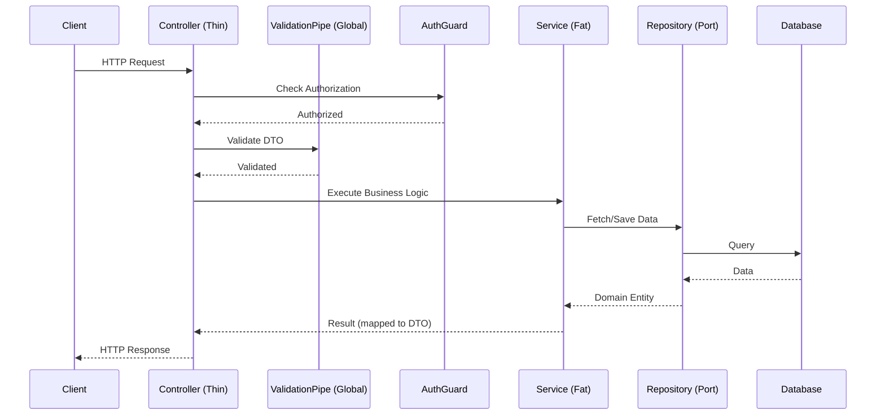

<div align="center">
  
  
  # 🦁 NestJS Production-Ready Best Practices
</div>
---

Этот документ определяет **лучшие практики (best practices)** для фреймворка NestJS. Руководство создано для обеспечения масштабируемости, безопасности и качества Enterprise-приложений.
## 🎯 Context & Scope
- **Primary Goal:** Предоставить строгие архитектурные правила и 30 паттернов разработки на NestJS.
- **Target Tooling:** AI-агенты (Cursor, Windsurf, Copilot) и Senior-разработчики.
- **Tech Stack Version:** NestJS 11+

> [!IMPORTANT]
> **Архитектурный стандарт (Contract):** Используйте строгую типизацию TypeScript, DI (Dependency Injection) и модульную структуру. Бизнес-логика должна быть изолирована от деталей HTTP-уровня и баз данных.
---

## 🔄 Architecture Data Flow



## 📚 Specialized Documentation
- [architecture.md](./architecture.md)
- [security-best-practices.md](./security-best-practices.md)
---
### 🚨 1. Clean Architecture Modules (Изоляция логики)
#### ❌ Bad Practice
```typescript
@Injectable()
export class UsersService {
  constructor(@InjectRepository(User) private repo: Repository<User>) {} // Жесткая привязка к TypeORM
}
```
#### ⚠️ Problem
Жесткая привязка к конкретной ORM (например, TypeORM) нарушает принцип инверсии зависимостей. Это делает замену базы данных или ORM невозможной без переписывания бизнес-логики и усложняет модульное тестирование. Это отклоняется от современных детерминированных стандартов, усложняя понимание и безопасное расширение кода для ИИ-агентов и Senior-разработчиков.
#### ✅ Best Practice
```typescript
@Injectable()
export class UsersService {
  constructor(@Inject('IUserRepository') private repo: IUserRepository) {} // Интерфейс порта
}
```
#### 🚀 Solution
Применяйте инверсию зависимостей (Dependency Inversion). Бизнес-логика зависит от абстракций (интерфейсов), а не от конкретных ORM.

### 🚨 2. Global ValidationPipe
#### ❌ Bad Practice
```typescript
@Post()
create(@Body() dto: CreateUserDto) {
  if (!dto.email) throw new BadRequestException('Email required');
}
```
#### ⚠️ Problem
Ручная валидация каждого поля в контроллерах приводит к дублированию кода и риску пропустить важные проверки, открывая уязвимости для некорректных данных или инъекций. Это отклоняется от современных детерминированных стандартов, усложняя понимание и безопасное расширение кода для ИИ-агентов и Senior-разработчиков.
#### ✅ Best Practice
```typescript
// main.ts
app.useGlobalPipes(new ValidationPipe({ whitelist: true, forbidNonWhitelisted: true }));
```
#### 🚀 Solution
Включите глобальную валидацию на основе `class-validator` и `whitelist`, чтобы автоматически отсекать неизвестные поля.

### 🚨 3. Data Transfer Objects (DTO)
#### ❌ Bad Practice
```typescript
@Post()
create(@Body() body: unknown) {} // Потеря типизации
```
#### ⚠️ Problem
Использование типа `any` или `unknown` лишает TypeScript его главной силы — строгой типизации. Это может привести к ошибкам во время выполнения, если структура данных изменится. Это отклоняется от современных детерминированных стандартов, усложняя понимание и безопасное расширение кода для ИИ-агентов и Senior-разработчиков.
#### ✅ Best Practice
```typescript
export class CreateUserDto {
  @IsEmail()
  email: string;
}
@Post()
create(@Body() dto: CreateUserDto) {}
```
#### 🚀 Solution
Все данные от клиента должны строго описываться через DTO с декораторами валидации.

### 🚨 4. Fat Controllers vs Thin Controllers
#### ❌ Bad Practice
```typescript
@Post()
async createUser(@Body() dto: CreateDto) {
  const hash = await bcrypt.hash(dto.password, 10);
  return this.db.users.create({ ...dto, hash });
}
```
#### ⚠️ Problem
Размещение бизнес-логики в контроллерах нарушает принцип единой ответственности (SRP). Такие контроллеры становятся трудно тестировать и переиспользовать. Это отклоняется от современных детерминированных стандартов, усложняя понимание и безопасное расширение кода для ИИ-агентов и Senior-разработчиков.
#### ✅ Best Practice
```typescript
@Post()
async createUser(@Body() dto: CreateDto) {
  return this.userService.register(dto);
}
```
#### 🚀 Solution
Контроллеры только маршрутизируют запросы. Вся логика — в Service Layer.

### 🚨 5. Global Exception Filter
#### ❌ Bad Practice
```typescript
try { ... } catch (e) { throw new HttpException('Error', 500); }
```
#### ⚠️ Problem
Отсутствие централизованной обработки ошибок приводит к несогласованным ответам API и утечкам деталей реализации (например, stack trace) клиентам. Это отклоняется от современных детерминированных стандартов, усложняя понимание и безопасное расширение кода для ИИ-агентов и Senior-разработчиков.
#### ✅ Best Practice
```typescript
@Catch()
export class AllExceptionsFilter implements ExceptionFilter {
  catch(exception: unknown, host: ArgumentsHost) { /* Единый формат ошибки */ }
}
// main.ts
app.useGlobalFilters(new AllExceptionsFilter());
```
#### 🚀 Solution
Используйте фильтры исключений для стандартизации формата всех HTTP-ошибок API.

### 🚨 6. Async Module Configuration
#### ❌ Bad Practice
```typescript
TypeOrmModule.forRoot({ url: process.env.DB_URL }) // Переменные могут быть еще не загружены
```
#### ⚠️ Problem
Синхронная конфигурация модулей может привести к попыткам подключения до того, как переменные окружения (например, строки подключения к БД) будут загружены, вызывая сбой при запуске приложения. Это отклоняется от современных детерминированных стандартов, усложняя понимание и безопасное расширение кода для ИИ-агентов и Senior-разработчиков.
#### ✅ Best Practice
```typescript
TypeOrmModule.forRootAsync({
  imports: [ConfigModule],
  useFactory: (config: ConfigService) => ({ url: config.get('DB_URL') }),
  inject: [ConfigService],
})
```
#### 🚀 Solution
Для сторонних модулей всегда используйте `forRootAsync` / `registerAsync`, чтобы безопасно внедрять конфигурации.

### 🚨 7. Configuration Management
#### ❌ Bad Practice
```typescript
const secret = process.env.JWT_SECRET; // Прямой вызов
```
#### ⚠️ Problem
Прямое использование `process.env` разбросанное по коду усложняет тестирование и лишает типизации конфигурации, увеличивая вероятность опечаток и ошибок. Это отклоняется от современных детерминированных стандартов, усложняя понимание и безопасное расширение кода для ИИ-агентов и Senior-разработчиков.
#### ✅ Best Practice
```typescript
constructor(private configService: ConfigService) {}
const secret = this.configService.get<string>('JWT_SECRET');
```
#### 🚀 Solution
Используйте `@nestjs/config` для безопасного извлечения переменных с типизацией.

### 🚨 8. Custom Decorators (Извлечение User)
#### ❌ Bad Practice
```typescript
@Get()
getProfile(@Req() req: Request) { return req.user; }
```
#### ⚠️ Problem
Извлечение данных из `Req` в каждом методе контроллера создает избыточный код и усложняет чтение, а также повышает риск ошибки при смене структуры запроса. Это отклоняется от современных детерминированных стандартов, усложняя понимание и безопасное расширение кода для ИИ-агентов и Senior-разработчиков.
#### ✅ Best Practice
```typescript
export const CurrentUser = createParamDecorator((data, ctx: ExecutionContext) => ctx.switchToHttp().getRequest().user);

@Get()
getProfile(@CurrentUser() user: UserEntity) { return user; }
```
#### 🚀 Solution
Создавайте кастомные декораторы для чистой экстракции данных из Request (например, текущего пользователя).

### 🚨 9. JWT Guards (Защита роутов)
#### ❌ Bad Practice
```typescript
@Get()
getData(@Req() req) { if (!req.headers.auth) throw new UnauthorizedException(); }
```
#### ⚠️ Problem
Ручная проверка токенов в контроллерах неэффективна и может быть случайно пропущена. Это также смешивает бизнес-логику с логикой авторизации. Это отклоняется от современных детерминированных стандартов, усложняя понимание и безопасное расширение кода для ИИ-агентов и Senior-разработчиков.
#### ✅ Best Practice
```typescript
@UseGuards(JwtAuthGuard)
@Get()
getData() {}
```
#### 🚀 Solution
Авторизация должна происходить до контроллера через Guards (например, стратегия Passport JWT).

### 🚨 10. Role-Based Access Control (RBAC)
#### ❌ Bad Practice
```typescript
@Get()
getAdminData(@CurrentUser() user) { if (user.role !== 'ADMIN') throw new ForbiddenException(); }
```
#### ⚠️ Problem
Хардкодинг ролей внутри методов контроллера нарушает принцип OCP (Open-Closed Principle) и делает код трудно расширяемым и поддерживаемым. Это отклоняется от современных детерминированных стандартов, усложняя понимание и безопасное расширение кода для ИИ-агентов и Senior-разработчиков.
#### ✅ Best Practice
```typescript
@Roles('ADMIN')
@UseGuards(JwtAuthGuard, RolesGuard)
@Get()
getAdminData() {}
```
#### 🚀 Solution
Используйте кастомные декораторы ролей (`@Roles`) и `RolesGuard` для декларативного контроля доступа.

### 🚨 11. Built-in Pipes for Transformation
#### ❌ Bad Practice
```typescript
@Get(':id')
getUser(@Param('id') id: string) { const userId = parseInt(id, 10); }
```
#### ⚠️ Problem
Ручное преобразование типов параметров маршрута подвержено ошибкам и не предоставляет автоматической валидации (например, попытка распарсить некорректный ID). Это отклоняется от современных детерминированных стандартов, усложняя понимание и безопасное расширение кода для ИИ-агентов и Senior-разработчиков.
#### ✅ Best Practice
```typescript
@Get(':id')
getUser(@Param('id', ParseIntPipe) id: number) {}
```
#### 🚀 Solution
Используйте встроенные Pipes (`ParseIntPipe`, `ParseUUIDPipe`) для автоматической конвертации и валидации параметров.

### 🚨 12. Response Interceptors (Трансформация ответа)
#### ❌ Bad Practice
```typescript
return { success: true, data: result, timestamp: new Date() }; // Дублирование везде
```
#### ⚠️ Problem
Формирование структуры ответа вручную в каждом методе приводит к дублированию и несогласованности форматов ответов во всем API. Это отклоняется от современных детерминированных стандартов, усложняя понимание и безопасное расширение кода для ИИ-агентов и Senior-разработчиков.
#### ✅ Best Practice
```typescript
@Injectable()
export class TransformInterceptor implements NestInterceptor {
  intercept(context, next) { return next.handle().pipe(map(data => ({ success: true, data }))); }
}
```
#### 🚀 Solution
Стандартизируйте структуру успешного ответа глобально через Interceptor.

### 🚨 13. Logging Interceptors
#### ❌ Bad Practice
```typescript
@Get()
getData() { console.log('Request started'); /* ... */ console.log('Done'); }
```
#### ⚠️ Problem
Использование `console.log` не позволяет структурировать логи или задавать уровни логирования, что критично для мониторинга production-приложений. Это отклоняется от современных детерминированных стандартов, усложняя понимание и безопасное расширение кода для ИИ-агентов и Senior-разработчиков.
#### ✅ Best Practice
```typescript
@Injectable()
export class LoggingInterceptor implements NestInterceptor {
  intercept(ctx, next) {
    const now = Date.now();
    return next.handle().pipe(tap(() => console.log(`Time: ${Date.now() - now}ms`)));
  }
}
```
#### 🚀 Solution
Логируйте время выполнения и детали запроса абстрактно через Interceptors.

### 🚨 14. Transaction Handling (TypeORM)
#### ❌ Bad Practice
```typescript
await this.repo1.save(data1); await this.repo2.save(data2); // Нет транзакции
```
#### ⚠️ Problem
Отсутствие транзакций при мутации нескольких сущностей может привести к частичному сохранению данных в случае сбоя, нарушая консистентность базы данных. Это отклоняется от современных детерминированных стандартов, усложняя понимание и безопасное расширение кода для ИИ-агентов и Senior-разработчиков.
#### ✅ Best Practice
```typescript
await this.dataSource.transaction(async manager => {
  await manager.save(Entity1, data1);
  await manager.save(Entity2, data2);
});
```
#### 🚀 Solution
Критические мутации нескольких таблиц должны оборачиваться в транзакции через `DataSource.transaction`.

### 🚨 15. Swagger / OpenAPI Documentation
#### ❌ Bad Practice
```typescript
// Нет никаких аннотаций DTO
export class CreateDogDto { name: string; }
```
#### ⚠️ Problem
Отсутствие автоматической генерации документации усложняет интеграцию с frontend-разработчиками и сторонними клиентами API. Это отклоняется от современных детерминированных стандартов, усложняя понимание и безопасное расширение кода для ИИ-агентов и Senior-разработчиков.
#### ✅ Best Practice
```typescript
export class CreateDogDto {
  @ApiProperty({ example: 'Rex', description: 'The name of the dog' })
  name: string;
}
```
#### 🚀 Solution
Документируйте все свойства DTO через `@ApiProperty()`. Swagger автоматически сгенерирует схему.

### 🚨 16. Rate Limiting (ThrottlerModule)
#### ❌ Bad Practice
// Нет защиты от DDoS и брутфорса
#### ⚠️ Problem
Отсутствие ограничения количества запросов (Rate Limiting) делает API уязвимым для DDoS-атак и атак методом перебора (Brute Force). Это отклоняется от современных детерминированных стандартов, усложняя понимание и безопасное расширение кода для ИИ-агентов и Senior-разработчиков.
#### ✅ Best Practice
```typescript
// app.module.ts
ThrottlerModule.forRoot([{ ttl: 60000, limit: 10 }])
```
#### 🚀 Solution
Обязательно подключайте `@nestjs/throttler` для защиты API от перегрузок.

### 🚨 17. Caching Results
#### ❌ Bad Practice
// Каждый запрос делает тяжелый расчет в БД
#### ⚠️ Problem
Повторное выполнение тяжелых вычислительных или запросов к БД без кеширования перегружает сервер и базу данных, снижая производительность и увеличивая время ответа. Это отклоняется от современных детерминированных стандартов, усложняя понимание и безопасное расширение кода для ИИ-агентов и Senior-разработчиков.
#### ✅ Best Practice
```typescript
@UseInterceptors(CacheInterceptor)
@CacheTTL(30) // 30 секунд
@Get('stats')
getStats() {}
```
#### 🚀 Solution
Кешируйте тяжелые запросы через `CacheModule` (в памяти или Redis), чтобы разгрузить БД.

### 🚨 18. Event Emitter (Слабая связность)
#### ❌ Bad Practice
```typescript
await this.userService.create();
await this.emailService.send(); // Жесткая привязка зависимостей
```
#### ⚠️ Problem
Синхронный вызов побочных эффектов (например, отправка email) блокирует выполнение основного запроса и создает жесткую связность между доменами. Это отклоняется от современных детерминированных стандартов, усложняя понимание и безопасное расширение кода для ИИ-агентов и Senior-разработчиков.
#### ✅ Best Practice
```typescript
await this.userService.create();
this.eventEmitter.emit('user.created', new UserCreatedEvent(user));
```
#### 🚀 Solution
Используйте `@nestjs/event-emitter`. Сервис не должен ждать отправки письма, а просто публикует событие.

### 🚨 19. Task Scheduling (Cron)
#### ❌ Bad Practice
```typescript
setInterval(() => this.cleanupData(), 1000 * 60 * 60);
```
#### ⚠️ Problem
Использование нативного `setInterval` затрудняет управление, мониторинг и тестирование фоновых задач по сравнению с декларативным подходом. Это отклоняется от современных детерминированных стандартов, усложняя понимание и безопасное расширение кода для ИИ-агентов и Senior-разработчиков.
#### ✅ Best Practice
```typescript
@Cron(CronExpression.EVERY_DAY_AT_MIDNIGHT)
handleCron() { this.cleanupData(); }
```
#### 🚀 Solution
Для фоновых задач используйте `@nestjs/schedule` с декларативными декораторами.

### 🚨 20. Microservices: Message Patterns
#### ❌ Bad Practice
```typescript
@Post() // Использование HTTP для межсервисного общения
```
#### ⚠️ Problem
Синхронное HTTP-общение между микросервисами может привести к каскадным сбоям и неэффективному использованию ресурсов. Это отклоняется от современных детерминированных стандартов, усложняя понимание и безопасное расширение кода для ИИ-агентов и Senior-разработчиков.
#### ✅ Best Practice
```typescript
@MessagePattern({ cmd: 'get_user' })
getUser(data: unknown) { return this.userService.findById(data.id); }
```
#### 🚀 Solution
Для общения микросервисов внутри кластера используйте TCP, Redis или RabbitMQ через `@MessagePattern`.

### 🚨 21. Health Checks (Terminus)
#### ❌ Bad Practice
```typescript
@Get('ping') ping() { return 'pong'; }
```
#### ⚠️ Problem
Обычный `ping` не проверяет реальную работоспособность зависимостей (база данных, кэш), что может привести к тому, что оркестратор будет считать неисправный под рабочим. Это отклоняется от современных детерминированных стандартов, усложняя понимание и безопасное расширение кода для ИИ-агентов и Senior-разработчиков.
#### ✅ Best Practice
```typescript
@Get('health')
@HealthCheck()
check() { return this.health.check([() => this.db.pingCheck('database')]); }
```
#### 🚀 Solution
Используйте `@nestjs/terminus` для глубоких проверок (БД, память) для Kubernetes Liveness Probes.

### 🚨 22. Avoiding Circular Dependencies
#### ❌ Bad Practice
```typescript
// UserService -> AuthService -> UserService
@Injectable() class UserService { constructor(private auth: AuthService) {} }
```
#### ⚠️ Problem
Циклические зависимости свидетельствуют о плохом проектировании (сильная связность) и могут вызвать проблемы при инициализации модулей NestJS. Это отклоняется от современных детерминированных стандартов, усложняя понимание и безопасное расширение кода для ИИ-агентов и Senior-разработчиков.
#### ✅ Best Practice
```typescript
@Injectable() class UserService { constructor(@Inject(forwardRef(() => AuthService)) private auth: AuthService) {} }
```
#### 🚀 Solution
Если архитектура вынуждает циклическую зависимость, используйте `forwardRef()`, однако лучше отрефакторить код.

### 🚨 23. Module Re-exporting
#### ❌ Bad Practice
```typescript
// Модуль B импортирует Модуль А, Модуль С импортирует Модуль А...
```
#### ⚠️ Problem
Постоянный импорт одних и тех же модулей в разных частях приложения усложняет структуру и делает ее трудно поддерживаемой. Это отклоняется от современных детерминированных стандартов, усложняя понимание и безопасное расширение кода для ИИ-агентов и Senior-разработчиков.
#### ✅ Best Practice
```typescript
@Module({ imports: [DatabaseModule], exports: [DatabaseModule] })
export class CoreModule {} // Глобальный фасад
```
#### 🚀 Solution
Используйте экспорт модулей для создания общих Core/Shared модулей, инкапсулирующих общую логику.

### 🚨 24. Global Middleware
#### ❌ Bad Practice
// Определение логгера запросов в каждом месте
#### ⚠️ Problem
Регистрация глобальных операций вручную в каждом контроллере приводит к дублированию и риску пропуска важных обработчиков (например, логирования или прикрепления Request ID). Это отклоняется от современных детерминированных стандартов, усложняя понимание и безопасное расширение кода для ИИ-агентов и Senior-разработчиков.
#### ✅ Best Practice
```typescript
export class AppModule implements NestModule {
  configure(consumer: MiddlewareConsumer) { consumer.apply(LoggerMiddleware).forRoutes('*'); }
}
```
#### 🚀 Solution
Глобальные операции до попадания в Guards (например, Request ID) делайте через `NestMiddleware`.

### 🚨 25. Unit Testing Providers
#### ❌ Bad Practice
```typescript
const service = new UserService(new Database()); // Реальная БД в тестах
```
#### ⚠️ Problem
Использование реальных баз данных в юнит-тестах делает их медленными, нестабильными (flaky) и зависимыми от окружения. Это отклоняется от современных детерминированных стандартов, усложняя понимание и безопасное расширение кода для ИИ-агентов и Senior-разработчиков.
#### ✅ Best Practice
```typescript
const module = await Test.createTestingModule({
  providers: [UserService, { provide: getRepositoryToken(User), useValue: mockUserRepo }],
}).compile();
```
#### 🚀 Solution
Все юнит-тесты должны использовать инъекцию моков (Mocks) через `Test.createTestingModule`.

### 🚨 26. Custom Validation Constraints
#### ❌ Bad Practice
```typescript
if (!isEmailUnique(dto.email)) throw error; // Ручная логика в сервисе
```
#### ⚠️ Problem
Размещение логики валидации (особенно с запросами к БД) в сервисах усложняет код и дублирует функционал, который лучше решается на уровне DTO. Это отклоняется от современных детерминированных стандартов, усложняя понимание и безопасное расширение кода для ИИ-агентов и Senior-разработчиков.
#### ✅ Best Practice
```typescript
@ValidatorConstraint({ async: true })
export class IsUniqueConstraint implements ValidatorConstraintInterface { ... }

@Validate(IsUniqueConstraint) email: string;
```
#### 🚀 Solution
Создавайте кастомные правила для `class-validator`, в том числе асинхронные проверки (проверка БД).

### 🚨 27. File Uploading (Multer)
#### ❌ Bad Practice
// Обработка потоков руками
#### ⚠️ Problem
Ручная обработка файловых потоков чревата уязвимостями (например, отказ в обслуживании из-за огромных файлов) и трудно поддерживаема. Это отклоняется от современных детерминированных стандартов, усложняя понимание и безопасное расширение кода для ИИ-агентов и Senior-разработчиков.
#### ✅ Best Practice
```typescript
@Post('upload')
@UseInterceptors(FileInterceptor('file'))
uploadFile(@UploadedFile() file: Express.Multer.File) {}
```
#### 🚀 Solution
Для приема файлов стандартом является встроенный `FileInterceptor` на базе Multer.

### 🚨 28. Serialization (ClassSerializerInterceptor)
#### ❌ Bad Practice
```typescript
const { password, ...safeUser } = user; // Ручное удаление пароля
```
#### ⚠️ Problem
Ручное удаление конфиденциальных полей (таких как пароли) подвержено ошибкам человеческого фактора, что может привести к утечке данных. Это отклоняется от современных детерминированных стандартов, усложняя понимание и безопасное расширение кода для ИИ-агентов и Senior-разработчиков.
#### ✅ Best Practice
```typescript
class UserEntity { @Exclude() password: string; }

@UseInterceptors(ClassSerializerInterceptor) // Авто-очистка
@Get() getUser() { return new UserEntity(data); }
```
#### 🚀 Solution
Используйте `@Exclude()` из `class-transformer` вместе с `ClassSerializerInterceptor` для скрытия полей.

### 🚨 29. Fastify Integration
#### ❌ Bad Practice
// Вызов специфичных методов req.expressMethod
#### ⚠️ Problem
Прямое использование специфичных методов платформы (Express) привязывает код к конкретному фреймворку, делая невозможным переход на более быстрые альтернативы вроде Fastify. Это отклоняется от современных детерминированных стандартов, усложняя понимание и безопасное расширение кода для ИИ-агентов и Senior-разработчиков.
#### ✅ Best Practice
```typescript
const app = await NestFactory.create<NestFastifyApplication>(AppModule, new FastifyAdapter());
```
#### 🚀 Solution
Пишите платформо-независимый код. Если нужна экстремальная производительность, Nest легко переключается с Express на Fastify.

### 🚨 30. Shutdown Hooks (Graceful Shutdown)
#### ❌ Bad Practice
// Приложение убивается мгновенно, прерывая активные соединения
#### ⚠️ Problem
Мгновенное завершение работы сервера может прервать активные HTTP-запросы и оставить транзакции в базе данных незавершенными или поврежденными. Это отклоняется от современных детерминированных стандартов, усложняя понимание и безопасное расширение кода для ИИ-агентов и Senior-разработчиков.
#### ✅ Best Practice
```typescript
app.enableShutdownHooks();
@Injectable() class MyService implements OnApplicationShutdown { onApplicationShutdown() { /* Закрыть соединения */ } }
```
#### 🚀 Solution
Вызывайте `enableShutdownHooks()`, чтобы отлавливать SIGINT/SIGTERM и безопасно завершать процессы базы данных.


---
[⬆️ Back to Top](#)

<br>

<div align="center">
  <b>Применяйте эти паттерны NestJS для создания эталонного и поддерживаемого бэкенда! 🦁</b>
</div>
