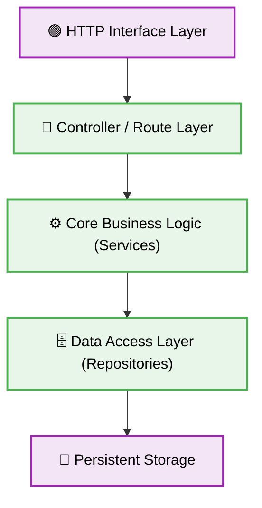

# 🟢 Node.js Architectural Patterns & Structuring

[⬅️ Back to Parent](./readme.md)

## 🎯 Context & Scope
This document strictly enforces the deterministic architectural boundaries and structural patterns for Node.js backend systems.



---

## 1. 🛑 Domain Coupling in Controllers
### ❌ Bad Practice
```javascript
// A controller handling HTTP request parsing, business logic, and database operations.
app.post('/api/users', async (req, res) => {
  const { name, email } = req.body;
  if (!email.includes('@')) return res.status(400).send('Invalid email');
  const user = await db.collection('users').insertOne({ name, email, createdAt: new Date() });
  await emailService.sendWelcome(email);
  res.status(201).json(user);
});
```
### ⚠️ Problem
Tightly coupling business logic and database queries directly inside the HTTP transport layer (controllers) prevents unit testing and code reusability. It violates the Single Responsibility Principle, turning routes into unmaintainable monoliths.
### ✅ Best Practice
```javascript
// Controller delegating logic to the Service Layer
app.post('/api/users', async (req, res, next) => {
  try {
    const userDTO = await userService.createUser(req.body);
    res.status(201).json(userDTO);
  } catch (error) {
    next(error);
  }
});
```

> [!NOTE]
> **Internal Routing:** For more context, refer back to the [Nodejs Index](./readme.md).

### 🚀 Solution
Controllers MUST ONLY handle HTTP payload parsing and response formatting. Core business operations MUST be delegated to isolated Service classes.

## 2. 🗂️ Dependency Inversion

### ❌ Bad Practice
```javascript
// Hardcoding a database dependency directly into a service
const db = require('../config/database');

class UserService {
  async getUser(id) {
    return db.query('SELECT * FROM users WHERE id = ?', [id]);
  }
}
```
### ⚠️ Problem
Hardcoding infrastructural dependencies directly into the service layer creates rigid code. It prevents dynamic swapping of database adapters and blocks the use of isolated mock databases during unit testing.
### ✅ Best Practice
```javascript
// Injecting dependencies through the constructor
class UserService {
  constructor(userRepository) {
    this.userRepository = userRepository;
  }

  async getUser(id) {
    return this.userRepository.findById(id);
  }
}
```
### 🚀 Solution
STRICTLY apply Dependency Injection. Services MUST receive infrastructural dependencies via their constructor, enabling decoupled layers and testability.

## 3. 🌐 Global State Mutation

### ❌ Bad Practice
```javascript
// Mutating global process.env during runtime
function setConfig(newPort) {
  process.env.PORT = newPort;
}
```
### ⚠️ Problem
Mutating global state variables like `process.env` during application runtime creates unpredictable, non-deterministic side effects across all imported modules. This leads to untraceable bugs in asynchronous execution.
### ✅ Best Practice
```javascript
// Using an immutable configuration object
const config = Object.freeze({
  port: process.env.PORT || 3000,
  dbUrl: process.env.DATABASE_URL
});
```
### 🚀 Solution
Configuration objects MUST be locked and immutable after initialization. FORBID any runtime mutations to the global execution environment.
