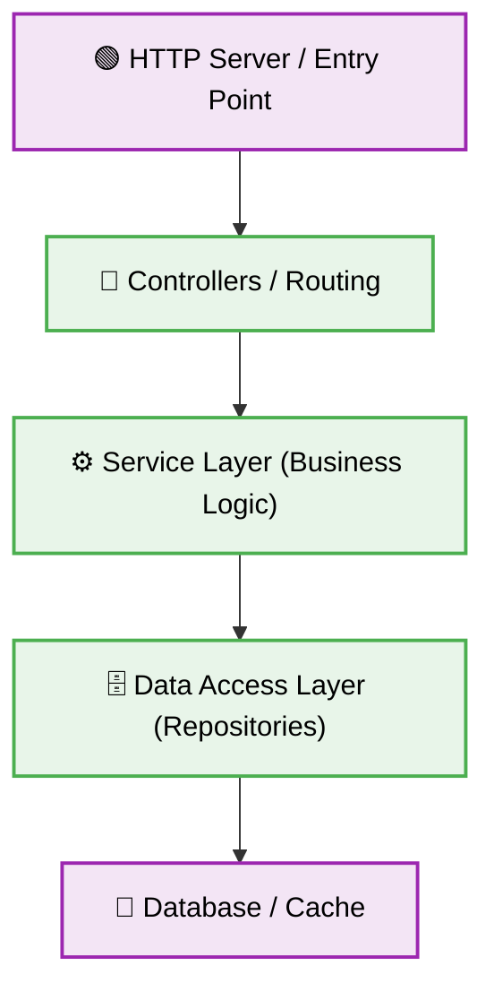

<div align="center">
  

  # 🟢 Node.js Production-Ready Best Practices
</div>

---

This document establishes **best practices** for building and maintaining Node.js applications. These constraints guarantee a scalable, highly secure, and clean architecture suitable for an enterprise-level, production-ready backend.

# ⚙️ Context & Scope
- **Primary Goal:** Provide an uncompromising set of rules and architectural constraints for pure Node.js environments.
- **Target Tooling:** AI-agents (Cursor, Windsurf, Copilot, Antigravity) and Senior Developers.
- **Tech Stack Version:** Node.js 24+

> [!IMPORTANT]
> **Architectural Contract:** Code must be completely asynchronous. Absolutely avoid synchronous blocking methods like `readFileSync` or `crypto.pbkdf2Sync` on the main thread. Delegate heavy computational tasks to Worker Threads or separate microservices to keep the event loop non-blocking.

---

## 🏗️ Architecture & Component Isolation

Node.js applications must use explicit module separation to handle logic appropriately.



---

## 1. ⚡ Blocking the Event Loop
### ❌ Bad Practice
```javascript
const crypto = require('crypto');
app.post('/hash', (req, res) => {
  const hash = crypto.pbkdf2Sync(req.body.password, 'salt', 100000, 64, 'sha512'); // Blocks the whole server
  res.send(hash);
});
```
### ✅ Best Practice
```javascript
const crypto = require('crypto');
app.post('/hash', (req, res, next) => {
  crypto.pbkdf2(req.body.password, 'salt', 100000, 64, 'sha512', (err, derivedKey) => {
    if (err) return next(err);
    res.send(derivedKey.toString('hex'));
  });
});
```
### 🚀 Solution
Never use synchronous methods (`*Sync`) on the main thread for crypto, I/O, or heavy calculations. Always use asynchronous callbacks or Promises to prevent blocking the Event Loop.

## 2. 🗂️ Project Structure & Module Separation
### ❌ Bad Practice
```text
/server.js (Contains routes, DB connections, and logic all in one 1500-line file)
```
### ✅ Best Practice
```text
/src
  /api (Controllers and routes)
  /services (Business logic)
  /models (Database schemas)
  /config (Environment and configurations)
  /utils (Helper functions)
```
### 🚀 Solution
Implement a multi-layered folder architecture. Strictly separate the HTTP transport layer (Routes/Controllers) from the Business Logic (Services) and Database operations.

## 3. 🛡️ Strict Environment Configuration
### ❌ Bad Practice
```javascript
const port = process.env.PORT || 3000;
// Continuing application startup without validating required variables.
```
### ✅ Best Practice
```javascript
const requiredEnv = ['DATABASE_URL', 'JWT_SECRET', 'PORT'];
requiredEnv.forEach((name) => {
  if (!process.env[name]) {
    console.error(`Environment variable ${name} is missing.`);
    process.exit(1);
  }
});
```
### 🚀 Solution
Fail fast. Validate all necessary environment variables upon application startup to prevent fatal runtime errors later in execution.

## 4. 🛑 Error Handling with Custom Classes
### ❌ Bad Practice
```javascript
if (!user) throw new Error('User not found');
```
### ✅ Best Practice
```javascript
class AppError extends Error {
  constructor(message, statusCode) {
    super(message);
    this.statusCode = statusCode;
    this.isOperational = true; // Distinguish between operational and programming errors
  }
}
if (!user) throw new AppError('User not found', 404);
```
### 🚀 Solution
Extend the built-in `Error` object to create custom operational errors. This allows your global error handler to safely log and return predictable HTTP status codes without crashing the application.

## 5. 🎛️ Handling Uncaught Exceptions & Rejections
### ❌ Bad Practice
// Ignoring process-level events, allowing the app to run in an unpredictable state after an error.
### ✅ Best Practice
```javascript
process.on('uncaughtException', (err) => {
  logger.error('UNCAUGHT EXCEPTION! Shutting down...', err);
  process.exit(1);
});

process.on('unhandledRejection', (err) => {
  logger.error('UNHANDLED REJECTION! Shutting down...', err);
  server.close(() => process.exit(1));
});
```
### 🚀 Solution
Always capture `uncaughtException` and `unhandledRejection`. Log the fatal error immediately and shut down the process safely. Rely on a process manager (like PM2 or Kubernetes) to restart the container.

## 6. 🔒 Hiding Sensitive Headers
### ❌ Bad Practice
// Sending default headers that expose the framework, like `X-Powered-By: Express`.
### ✅ Best Practice
```javascript
// Example using Express + Helmet, but applies generically to HTTP responses
const helmet = require('helmet');
app.use(helmet());
```
### 🚀 Solution
Sanitize outgoing HTTP headers to prevent information leakage about the server infrastructure.

## 7. ⏱️ Implementing Graceful Shutdown
### ❌ Bad Practice
// Application crashes abruptly during deployments, interrupting active user requests and corrupting database transactions.
### ✅ Best Practice
```javascript
process.on('SIGTERM', () => {
  console.info('SIGTERM signal received. Closing HTTP server.');
  server.close(() => {
    console.log('HTTP server closed.');
    mongoose.connection.close(false, () => {
      console.log('Database connection closed.');
      process.exit(0);
    });
  });
});
```
### 🚀 Solution
Listen for termination signals (`SIGTERM`, `SIGINT`). Finish processing ongoing HTTP requests and safely close database connections before exiting the Node.js process.

## 8. 🔍 Input Validation and Sanitization
### ❌ Bad Practice
```javascript
// Blindly trusting user input
const user = await db.query(`SELECT * FROM users WHERE email = '${req.body.email}'`);
```
### ✅ Best Practice
```javascript
// Utilizing parameterized queries and a validation library like Joi or Zod
const schema = Joi.object({ email: Joi.string().email().required() });
const { error, value } = schema.validate(req.body);

if (error) throw new AppError('Invalid input', 400);
const user = await db.query('SELECT * FROM users WHERE email = $1', [value.email]);
```
### 🚀 Solution
Never trust external data. Validate input strictly using schema definitions and always utilize parameterized queries or an ORM to prevent SQL/NoSQL Injection attacks.

## 9. 🚀 Utilizing Worker Threads for Heavy Tasks
### ❌ Bad Practice
```javascript
// Processing a massive image buffer directly on the main event loop
function processImage(buffer) {
  // heavy sync computation taking 500ms...
}
```
### ✅ Best Practice
```javascript
const { Worker } = require('worker_threads');

function processImageAsync(buffer) {
  return new Promise((resolve, reject) => {
    const worker = new Worker('./imageProcessor.js', { workerData: buffer });
    worker.on('message', resolve);
    worker.on('error', reject);
  });
}
```
### 🚀 Solution
Offload CPU-intensive operations (image processing, video encoding, heavy cryptographic tasks) to Node.js `worker_threads` to keep the primary event loop highly responsive for API requests.

## 10. 📝 Centralized and Structured Logging
### ❌ Bad Practice
```javascript
console.log('User logged in', userId);
```
### ✅ Best Practice
```javascript
const winston = require('winston');
const logger = winston.createLogger({
  level: 'info',
  format: winston.format.json(),
  transports: [new winston.transports.Console()],
});

logger.info('User logged in', { userId, timestamp: new Date().toISOString() });
```
### 🚀 Solution
Avoid `console.log`. Use a sophisticated logging library (like Pino or Winston) to generate structured, JSON-formatted logs that are easily ingested by external monitoring systems (Datadog, ELK).

<br>

<div align="center">
  <b>Enforce these Core Node.js constraints to ensure a highly scalable, stable, and performant backend system! 🟢</b>
</div>
