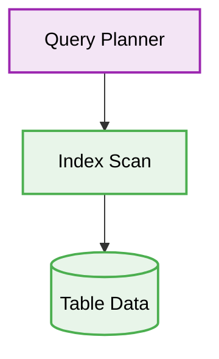

# 🐘 PostgreSQL Database Optimization

[⬅️ Back to Parent](./readme.md)


## 1. 🛑 Missing Indexes on Foreign Keys
### ❌ Bad Practice
```sql
CREATE TABLE orders (
    id SERIAL PRIMARY KEY,
    user_id INT REFERENCES users(id),
    total DECIMAL
);
-- No index on user_id
```
### ⚠️ Problem
Failing to index foreign keys results in full table scans during joins and cascading deletes, leading to exponential performance degradation as data grows.
### ✅ Best Practice
```sql
CREATE TABLE orders (
    id SERIAL PRIMARY KEY,
    user_id INT REFERENCES users(id),
    total DECIMAL
);
CREATE INDEX idx_orders_user_id ON orders(user_id);
```

> [!NOTE]
> **Internal Routing:** For more context, refer back to the [Postgresql Index](./readme.md).

### 🚀 Solution
Always create explicit indexes on foreign key columns and frequently queried fields to ensure deterministic query execution times (O(log n) vs O(n)).

## 2. 🗂️ Architectural Workflow


