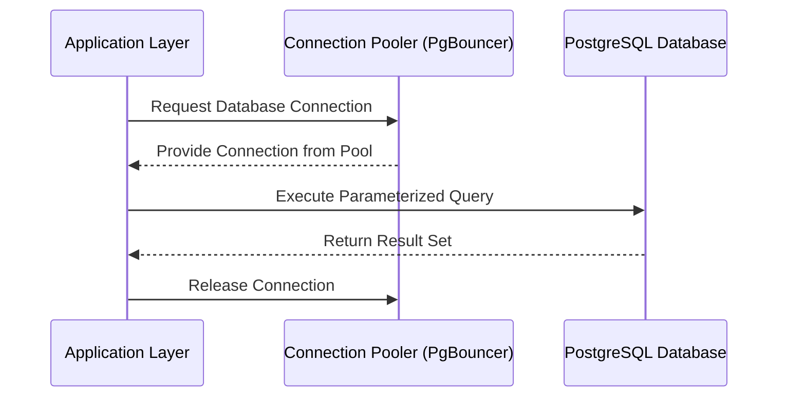

  

  # 🐘 PostgreSQL Production-Ready Best Practices

---

This document establishes **best practices** for building and maintaining PostgreSQL databases. These constraints guarantee a scalable, highly secure, and clean architecture suitable for an enterprise-level, production-ready backend.

# ⚙️ Context & Scope
- **Primary Goal:** Provide an uncompromising set of rules and architectural constraints for PostgreSQL environments.
- **Target Tooling:** AI-agents (Cursor, Windsurf, Copilot, Antigravity) and Senior Database Administrators.
- **Tech Stack Version:** PostgreSQL 16+

> [!IMPORTANT]
> **Architectural Standard (Contract):** Use strict data types, enforce referential integrity, and optimize queries with appropriate indexing. Avoid business logic in stored procedures unless strictly necessary for performance.

---

## 🏗️ 1. Architecture & Design

### Database Schema Design
- **Normalized by Default:** Start with 3NF (Third Normal Form) to minimize redundancy.
- **Denormalize for Read Performance:** Selectively denormalize where read heavy workloads require optimization, utilizing Materialized Views.
- **Primary Keys:** Use `UUIDv7` or `BIGINT IDENTITY` (PostgreSQL 10+) for primary keys over sequential `SERIAL`.

### 🔄 Data Flow Lifecycle

## 🔒 2. Security Best Practices

### Connection Security
- Enforce SSL/TLS for all database connections.
- Utilize a connection pooler like PgBouncer for performance and connection limit management.

### Access Control
- Principle of Least Privilege (PoLP): Create specific database roles for different application services. Never use the `postgres` superuser for application access.
- Implement Row-Level Security (RLS) for multi-tenant applications to isolate data at the database layer.

## 🚀 3. Performance Optimization

### Indexing Strategies
- Use B-Tree indexes for equality and range queries.
- Implement GIN/GiST indexes for Full-Text Search and JSONB fields.
- Avoid over-indexing, as it degrades write performance. Monitor unused indexes and remove them.

### Query Optimization
- Explicit DB queries required: Never use `SELECT *`. Only select the specific columns needed.
- Utilize `EXPLAIN ANALYZE` to identify query bottlenecks.
- Implement pagination using keyset pagination (cursor-based) instead of `OFFSET`/`LIMIT` for large datasets.

## 📚 Specialized Documentation
- [architecture.md](./architecture.md)
- [security-best-practices.md](./security-best-practices.md)
- [database-optimization.md](./database-optimization.md)

---

[Back to Top](#)
