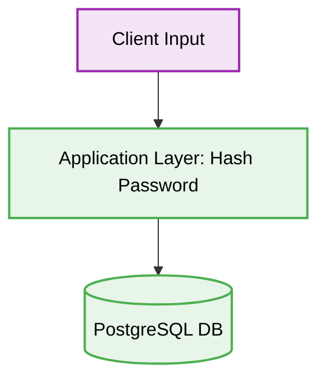

# 🐘 PostgreSQL Security Best Practices

[⬅️ Back to Parent](./readme.md)


## 1. 🛑 Plaintext Password Storage
### ❌ Bad Practice
```javascript
// Storing plain text passwords in the database
await pool.query(`INSERT INTO users (email, password) VALUES ($1, $2)`, [email, plaintextPassword]);
```
### ⚠️ Problem
Storing plaintext passwords is a catastrophic security failure. If the database is compromised, all user accounts are immediately vulnerable.
### ✅ Best Practice
```javascript
// Hashing the password using bcrypt or argon2
const hashedPassword = await bcrypt.hash(plaintextPassword, 10);
await pool.query(`INSERT INTO users (email, password_hash) VALUES ($1, $2)`, [email, hashedPassword]);
```

> [!NOTE]
> **Internal Routing:** For more context, refer back to the [Postgresql Index](./readme.md).

### 🚀 Solution
Always salt and hash passwords using strong cryptographic algorithms (like Argon2id or bcrypt) before storing them in PostgreSQL. Never store sensitive PII in plaintext.

## 2. 🗂️ Architectural Workflow


