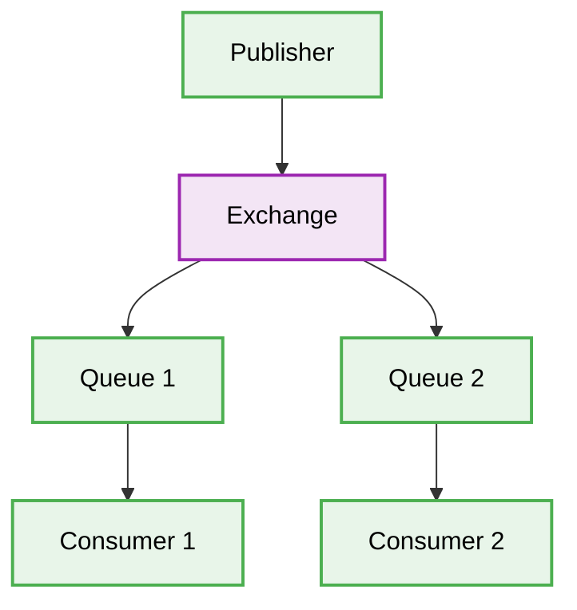

# 🐇 RabbitMQ Best Practices & Production-Ready Patterns

[⬅️ Back to Parent](../readme.md)

## 🎯 Context & Scope
- **Primary Goal:** Outline deterministic patterns for integrating RabbitMQ message brokering in backend applications.

## 🗺️ Map of Patterns


## 1. 🛑 Missing Dead Letter Exchanges (DLX)
### ❌ Bad Practice
```javascript
channel.assertQueue('task_queue', { durable: true });
```
### ⚠️ Problem
Failing to configure a Dead Letter Exchange means messages that repeatedly fail processing WILL loop infinitely or be dropped silently. This causes severe resource exhaustion and silent data loss.
### ✅ Best Practice
```javascript
channel.assertExchange('dlx_exchange', 'direct', { durable: true });
channel.assertQueue('dlx_queue', { durable: true });
channel.bindQueue('dlx_queue', 'dlx_exchange', 'dlx_routing_key');

channel.assertQueue('task_queue', {
  durable: true,
  arguments: {
    'x-dead-letter-exchange': 'dlx_exchange',
    'x-dead-letter-routing-key': 'dlx_routing_key'
  }
});
```

> [!IMPORTANT]
> **Constraint:** Always configure a DLX for business-critical queues to capture unprocessable messages for manual review or automated retry pipelines.

### 🚀 Solution
MANDATORY: Bind queues to a Dead Letter Exchange (DLX) using `x-dead-letter-exchange` arguments to handle failed messages deterministically.

## 2. 🛑 Unbounded Queue Growth (No TTL/Max Length)
### ❌ Bad Practice
```javascript
channel.assertQueue('log_queue', { durable: false });
```
### ⚠️ Problem
Allowing unbounded queue growth during consumer outages or traffic spikes WILL exhaust broker memory and crash the RabbitMQ node, leading to cluster-wide failure.
### ✅ Best Practice
```javascript
channel.assertQueue('log_queue', {
  durable: true,
  arguments: {
    'x-max-length': 10000,
    'x-overflow': 'reject-publish'
  }
});
```

> [!NOTE]
> Ensure producers handle `reject-publish` errors gracefully when queues hit their limits.

### 🚀 Solution
Apply strict limits to queues (e.g., `x-max-length`, `x-message-ttl`) and configure `x-overflow` policies to protect the broker's memory footprint.
