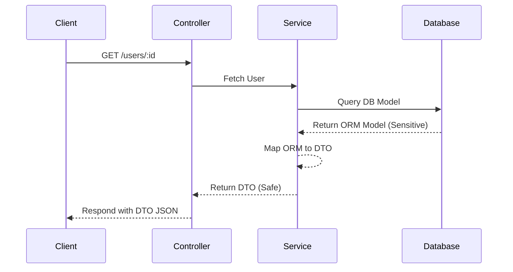

# Backend Best Practices & Production-Ready Patterns

[🏠 Back to Home](../README.md)

# Context & Scope
- **Primary Goal:** Outline the overarching philosophy and standards for Backend and system development inside the ecosystem.
- **Target Tooling:** Cursor, Windsurf, Antigravity.
- **Tech Stack Version:** Agnostic

<div align="center">
  
  
  **The foundational rules and standards governing backend logic.**
</div>
---
## Architecture Principles

- Adhere to the defined [Architectural Patterns](../../architectures/readme.md) when building applications, specifically Hexagonal Architecture / Clean Architecture.
- Avoid tightly coupling business domains to framework-specific libraries.
## Technical Requirements for AI Generation

> [!IMPORTANT]
> **Constraint:** Never allow Database Object Relational Mapping (ORM) models to bleed into standard HTTP responses. Always map through a DTO.

- **Security First:** Validate all inputs using schema validations. Assume all external input is malicious.
- **TypeScript Strictness:** `any` is strictly prohibited. Enforce boundary definitions between the transport and core logic layers.
## Technologies Included


This folder acts as a container for documentation around the following backend technologies:
- [NestJS](./nestjs/readme.md)
- [ExpressJS](./expressjs/readme.md)
- [Node.js](./nodejs/readme.md)
- [GraphQL](./graphql/readme.md)
- [PostgreSQL](./postgresql/readme.md)
- [MongoDB](./mongodb/readme.md)
- [Redis](./redis/readme.md)
- [Microservices](./microservices/readme.md)

---
## 1. 🛑 Global Domain Bleeding
### ❌ Bad Practice
```javascript
// Returning database ORM models directly in HTTP responses
app.get('/users/:id', async (req, res) => {
  const user = await db.User.findByPk(req.params.id);
  res.json(user); // Exposes sensitive database fields like passwords or salts
});
```
### ⚠️ Problem
Returning database ORM models directly in HTTP responses tightly couples the database schema to the API contract. This exposes sensitive internal fields (like password hashes or internal IDs) and prevents evolving the database schema without breaking API clients.
### ✅ Best Practice
```javascript
// Mapping the database entity to a specialized DTO
app.get('/users/:id', async (req, res) => {
  const user = await db.User.findByPk(req.params.id);
  const userDTO = { id: user.id, username: user.username, email: user.email };
  res.json(userDTO);
});
```

> [!NOTE]
> **Internal Routing:** For more context, refer back to the [Global Index](../README.md).

### 🚀 Solution
Never allow Database Object Relational Mapping (ORM) models to bleed into standard HTTP responses. Always map through a DTO.

### 🔄 Domain DTO Mapping Lifecycle


