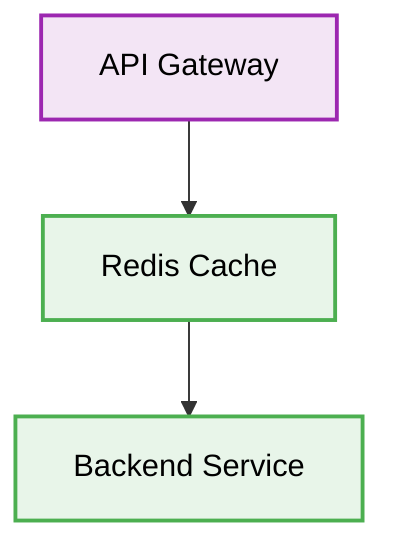

# 🟥 Redis API Design

[⬅️ Back to Parent](./readme.md)


## 1. 🛑 API Design: Blocking Commands
### ❌ Bad Practice
```javascript
// Using KEYS in production which blocks Redis
client.keys('*');
```
### ⚠️ Problem
Using `KEYS` command blocks the single-threaded Redis server, causing huge performance issues and potentially freezing your entire application.
### ✅ Best Practice
```javascript
// Use SCAN for iterating over keys
let cursor = '0';
do {
    const reply = await client.scan(cursor, 'MATCH', 'user:*', 'COUNT', '100');
    cursor = reply[0];
    const keys = reply[1];
    // process keys
} while (cursor !== '0');
```

### 🚀 Solution
Always use `SCAN` instead of `KEYS` to iterate over large datasets without blocking the Redis event loop.

## 2. 🗂️ Architectural Workflow


