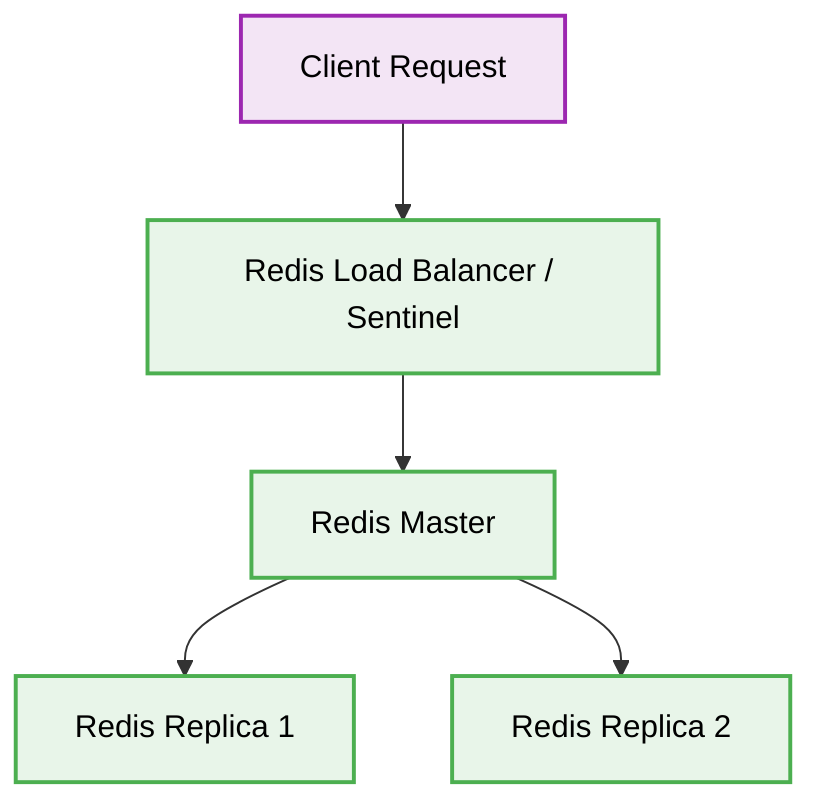

# 🟥 Redis Architecture

[⬅️ Back to Parent](./readme.md)


## 1. 🛑 Single Point of Failure
### ❌ Bad Practice
```yaml
# Docker compose with a single redis node
services:
  redis:
    image: redis:latest
```
### ⚠️ Problem
A single Redis instance creates a single point of failure. If the node crashes, all cached data is lost and system performance severely degrades.
### ✅ Best Practice
```yaml
# Using Redis Cluster or Sentinel for high availability
services:
  redis-master:
    image: redis:latest
  redis-replica-1:
    image: redis:latest
  redis-sentinel:
    image: redis:latest
```
> [!NOTE]
> **Internal Routing:** [./readme.md](./readme.md)


> [!NOTE]
> **Internal Routing:** For more context, refer back to the [Redis Index](./readme.md).

### 🚀 Solution
Deploy Redis in a Cluster or Sentinel topology to ensure high availability, automatic failover, and data redundancy.

## 2. 🗂️ Architectural Workflow


