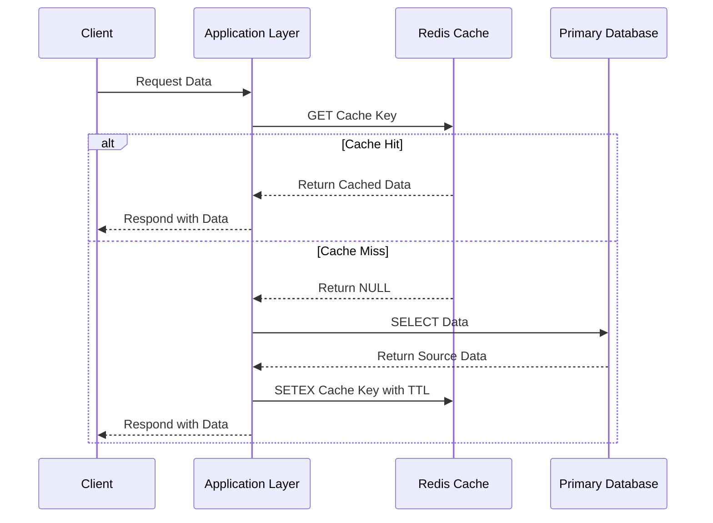

  

  # 🟥 Redis Production-Ready Best Practices

---

This document establishes **best practices** for building and maintaining Redis data stores. These constraints guarantee a scalable, highly secure, and clean architecture suitable for an enterprise-level, production-ready backend.

# ⚙️ Context & Scope
- **Primary Goal:** Provide an uncompromising set of rules and architectural constraints for Redis environments.
- **Target Tooling:** AI-agents (Cursor, Windsurf, Copilot, Antigravity) and Senior Backend Developers.
- **Tech Stack Version:** Redis 7+

> [!IMPORTANT]
> **Architectural Standard (Contract):** Utilize Redis primarily as a caching layer, session store, or message broker, not as a primary persistence database. Never use `KEYS *` in production.

---

## 🏗️ 1. Architecture & Design

### Cache Design
- **Cache-Aside Pattern:** Applications should read from the cache first; on a cache miss, read from the database, populate the cache, and return the result.
- **TTL Requirements:** Every cached key must have an expiration Time-To-Live (TTL) to prevent memory exhaustion and stale data.

### 🔄 Data Flow Lifecycle

## 🔒 2. Security Best Practices

### Connection Security
- Never expose Redis to the public internet. Ensure it is isolated within a private network.
- Enable requirepass to enforce password authentication.
- Rename dangerous commands (like `FLUSHALL`, `FLUSHDB`, `CONFIG`) in production to prevent accidental data loss.

### Network Architecture
- Utilize TLS (Transport Layer Security) for encrypting data in transit.

## 🚀 3. Performance Optimization

### Command Usage
- Use pipelining to send multiple commands to the server without waiting for the replies, optimizing latency.
- Strictly avoid blocking operations like `KEYS *`, and `SMEMBERS` on large sets. Use `SCAN` and `SSCAN` for iteration.

### Data Types
- Optimize data structure usage. Employ Hashes for objects to save memory, and Sorted Sets for leaderboards or rate limiting.
- Avoid large keys or values (keep them under 512MB, but ideally much smaller) to minimize network transfer and memory overhead.

## 📚 Specialized Documentation
- [architecture.md](./architecture.md)
- [security-best-practices.md](./security-best-practices.md)
- [api-design.md](./api-design.md)

---

[Back to Top](#)
