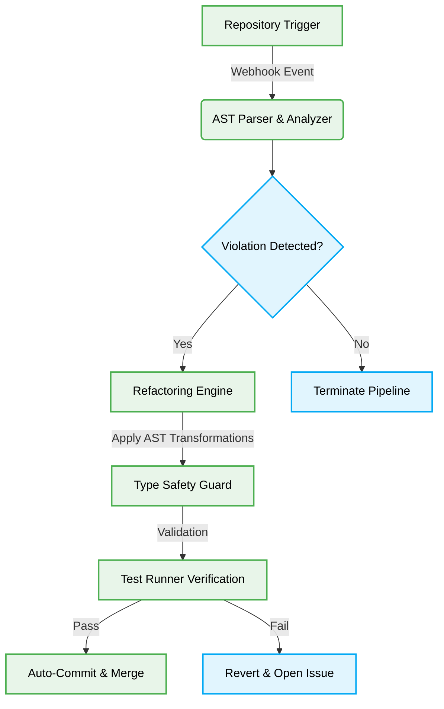

# 🤖 AI Agent Autonomous Refactoring Pipelines

> [!NOTE]
> This pattern defines the strict, zero-approval pipeline for AI Agents to autonomously refactor legacy code, upgrade dependencies, and ensure type safety without human intervention.

## 🏗️ Architectural Pattern

The Autonomous Refactoring Pipeline is a deterministic workflow that relies on AST (Abstract Syntax Tree) analysis, Type Guards, and self-validating state machines to ensure code manipulations are structurally safe and semantically identical to their original intent.



### ⚖️ Structural Comparison: Legacy vs. Autonomous Refactoring

| Feature | Legacy Refactoring | Autonomous Refactoring |
| :--- | :--- | :--- |
| **Execution Speed** | Manual/Days | O(1) per file/Milliseconds |
| **Type Safety Validation** | Code Review / Human Error | Strict AST Validation |
| **Approval Flow** | Multi-layer PRs | Zero-Approval Mandate |
| **Rollback Strategy** | Manual Revert | Automatic State Reversion |

## 🔄 The Pattern Lifecycle

### ❌ Bad Practice: Regex-Based Refactoring
Using Regex for bulk refactoring operations is unsafe as it lacks structural context and can inadvertently modify strings, comments, or unrelated code structures.

```typescript
// Anti-pattern: String replacement for updating API versions
function upgradeApiVersion(code: string): string {
    // Dangerous: Might replace 'v1' inside user data or comments
    return code.replace(/v1/g, 'v2');
}

// Anti-pattern: Using 'any' bypasses the compiler
function processPayload(payload: any): void {
    console.log(payload.data.id); // Runtime error if payload is malformed
}
```

### ⚠️ Problem: Context Loss and Runtime Failures
- **AST Ignorance:** Regex cannot distinguish between a variable named `v1` and a string literal `'v1'`. This MUST lead to syntax errors or corrupted business logic.
- **Type Safety Compromise:** Utilizing `any` removes the TypeScript compiler's ability to verify data structures, introducing severe runtime vulnerabilities and reducing the fidelity score.
- **AI Hallucinations:** Agents relying on text-based patching frequently hallucinate the surrounding context, causing unbalanced brackets or broken imports.

### ✅ Best Practice: AST-Driven Transformations with Type Guards
Refactoring pipelines MUST utilize deterministic AST parsing tools (e.g., `ts-morph`) to manipulate code nodes and enforce strict type safety using `unknown` and custom Type Guards.

```typescript
import { Project, SyntaxKind, StringLiteral } from 'ts-morph';

// Interface representing the expected payload structure
export interface RefactorPayload {
    data: {
        id: string;
        version: number;
    };
}

// Type Guard to deterministically validate the payload at runtime
export function isRefactorPayload(payload: unknown): payload is RefactorPayload {
    if (typeof payload !== 'object' || payload === null) return false;

    const p = payload as Record<string, unknown>;
    if (typeof p.data !== 'object' || p.data === null) return false;

    const data = p.data as Record<string, unknown>;
    return typeof data.id === 'string' && typeof data.version === 'number';
}

// Deterministic AST manipulation
export async function upgradeApiVersionAst(filePath: string): Promise<void> {
    const project = new Project();
    const sourceFile = project.addSourceFileAtPath(filePath);

    // Explicitly target only String Literals containing 'v1'
    const stringLiterals = sourceFile.getDescendantsOfKind(SyntaxKind.StringLiteral);

    stringLiterals.forEach((literal: StringLiteral) => {
        if (literal.getLiteralValue() === 'v1') {
            // Safely replace the value without breaking surrounding code
            literal.setLiteralValue('v2');
        }
    });

    // Save the deterministically updated file
    await sourceFile.save();
}

// Safe processing using 'unknown' and Type Guards
export function processSafePayload(payload: unknown): void {
    if (isRefactorPayload(payload)) {
        // TypeScript now guarantees payload.data.id exists and is a string
        console.log(`Processing ID: ${payload.data.id} (v${payload.data.version})`);
    } else {
        throw new Error('MANDATORY: Payload failed Type Guard validation.');
    }
}
```

### 🚀 Solution: Systemic Architectural Stability
- **Deterministic Accuracy:** By manipulating the AST directly, the agent understands the grammatical structure of the code. This ensures a 100% accurate transformation targeted specifically at the intended nodes, eliminating the risk of unintended side effects.
- **Runtime Confidence:** Replacing `any` with `unknown` forces the implementation of Type Guards, pushing verification to runtime while maintaining compile-time safety.
- **Zero-Approval Ready:** Because AST manipulations are structurally guaranteed and Type Guards prevent unexpected runtime behaviors, these changes can be safely auto-committed and deployed to main without human oversight.

> [!IMPORTANT]
> Any autonomous refactoring script that modifies TypeScript files MUST use AST parsing libraries. Attempting text-based manipulation on `.ts` files will immediately flag the PR for rejection by the Vibe-Check runner.
