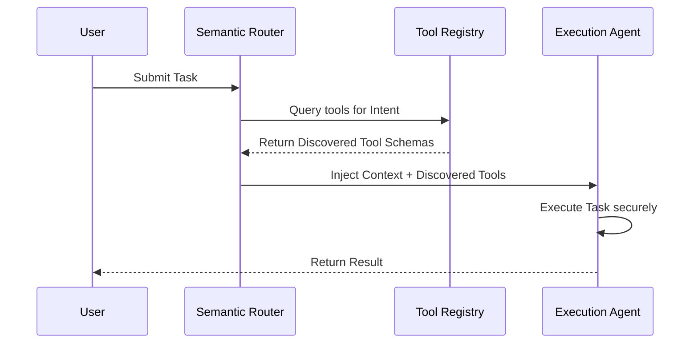

> 📦 [best-practise](../README.md) / 📄 [docs](./)

# 🤖 AI Agent Autonomous Tool Discovery

In 2026, dynamic and autonomous tool discovery is a critical pattern for robust multi-agent systems. Hardcoding tool schemas severely limits agent adaptability. Instead, agents MUST dynamically discover and parse tool interfaces at runtime using structured semantic registries.

---

## 🏗️ The Pattern Lifecycle

### ❌ Bad Practice
Hardcoding tool specifications within the agent's context limits scalability and increases hallucination risks.

```typescript
// Anti-Pattern: Hardcoded tool schemas
const agentTools = [
  {
    name: "fetchUserData",
    description: "Fetches user data",
    parameters: { type: "object", properties: { userId: { type: "string" } } }
  }
];

async function handleTask(task: any) {
  // Executing task with hardcoded tool
  return executeWithTools(task, agentTools);
}
```

### ⚠️ Problem
- **Maintenance Bottleneck:** Updating a tool requires updating the agent's source code.
- **Context Bloat:** Injecting all possible tools into the LLM context window degrades reasoning performance and increases token costs.
- **Type Safety Risk:** Using `any` for the task payload bypasses structural validation.

### ✅ Best Practice
Implement a dynamic, registry-based tool discovery mechanism with strict type safety.

```typescript
import { ToolRegistry } from './tool-registry';

// Best Practice: Dynamic discovery with strict Type Guards
interface TaskPayload {
  intent: string;
  context: Record<string, unknown>;
}

function isTaskPayload(data: unknown): data is TaskPayload {
  return typeof data === 'object' && data !== null && 'intent' in data && 'context' in data;
}

async function handleAutonomousTask(task: unknown, registry: ToolRegistry): Promise<unknown> {
  if (!isTaskPayload(task)) {
    throw new Error('Invalid task payload format');
  }

  // Dynamically discover only required tools based on semantic intent
  const discoveredTools = await registry.discoverToolsByIntent(task.intent);

  if (discoveredTools.length === 0) {
    throw new Error(`No tools found for intent: ${task.intent}`);
  }

  return executeWithDiscoveredTools(task, discoveredTools);
}
```

### 🚀 Solution
By utilizing a dynamic `ToolRegistry`, agents only load the necessary tool schemas directly correlated to the user's intent. This architectural decision strictly adheres to the Principle of Least Privilege for context injection, minimizing cognitive load on the LLM. Furthermore, replacing `any` with `unknown` and applying strict Type Guards guarantees deterministic runtime validation and systemic stability.

---

## 📊 Tool Discovery Sequence



> [!IMPORTANT]
> Always validate dynamically loaded tool schemas at runtime to prevent injection of malicious or malformed instructions into the execution context.

> [!NOTE]
> **Internal Routing:** For more context, refer back to the [AI Agent Orchestration Patterns](./ai-agent-orchestration-patterns.md) index.
