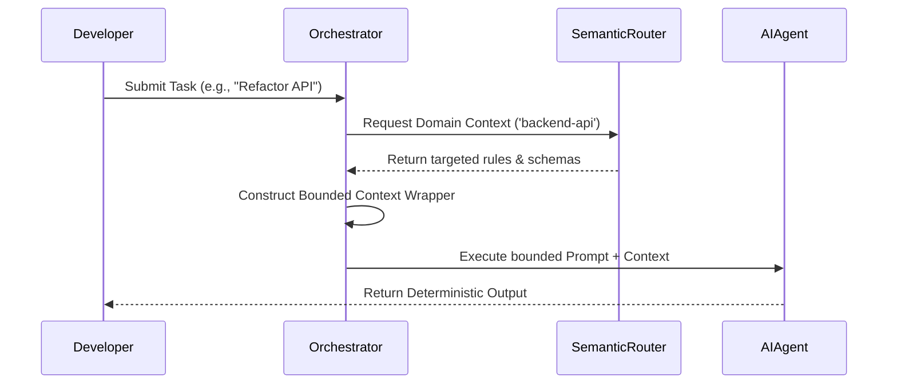

> 📦 [best-practise](../README.md) / 📄 [docs](./)

# 🤖 AI Agent Context Injection Pipelines Best Practices

In modern 2026 workflows, **Vibe Coding** relies on accurate, systemic knowledge transfer to AI Agents. When working with multi-agent orchestration or standalone autonomous coders, "Context Injection Pipelines" are the most critical layer. Without explicit, deterministic injection of architectural rules, AI agents generate technically valid but structurally incompatible code.

This document specifies the architectural constraints for creating robust Context Injection Pipelines.

---

## 🏗️ Systemic Injection Hierarchy

> [!IMPORTANT]
> Context MUST never be a monolithic blob. High-performance agent operations require progressive, context-aware drilling where an agent is only injected with the context it strictly requires to complete its bounded task.

### The Injection Layers

1. **Global Constants (Root Rules):** Foundational meta-instructions like coding style, tone, and repository constraints.
2. **Domain Specifications:** High-level architectural patterns (e.g., MVC, FSD) specific to the working domain.
3. **Technological Scoping:** Exact best practices for the chosen language or framework (e.g., NestJS, TypeScript).
4. **Task-Specific Hydration:** Injecting the exact schema, file dependencies, and interface contracts needed for the immediate execution.

> [!IMPORTANT]
> The primary cause of AI hallucinations is context bloat. Injecting the entire repository structure into an agent's memory window dilutes its focus. Context must be selectively hydrated based on the task bounds.

---

## 🔄 The Pattern Lifecycle

The repository enforces a strict four-step deterministic lifecycle for all context injection implementations to guarantee consistency and AI readability.

### ❌ Bad Practice

```typescript
// Dumping all rules blindly into the LLM context
async function executeAgentTask(prompt: string) {
    const globalRules = fs.readFileSync('.agents/rules/global.md', 'utf-8');
    const architectureRules = fs.readFileSync('architectures/readme.md', 'utf-8');
    const fullContext = `${globalRules}\n${architectureRules}\nTask: ${prompt}`;

    return await llm.complete(fullContext);
}
```

### ⚠️ Problem

Loading arbitrary markdown blobs indiscriminately into an agent's context window increases latency, introduces conflicting instructions if rules are nested, and drastically increases the chance of hallucinations. The LLM struggles to prioritize the task against thousands of tokens of generic rules.

### ✅ Best Practice

```typescript
// Deterministic Semantic Routing & Injection
import { SemanticRouter } from '@orchestration/router';
import { z } from 'zod';

const TaskContextSchema = z.object({
    taskType: z.enum(['frontend-ui', 'backend-api', 'architecture']),
    requiredTokens: z.number().max(8000),
    prompt: z.string()
});

async function executeAgentTask(input: unknown) {
    // 1. Validate Input Structure
    const validatedInput = TaskContextSchema.parse(input);

    // 2. Semantically Route required context
    const targetedRules = await SemanticRouter.fetchContext(validatedInput.taskType);

    // 3. Hydrate task with deterministic boundaries
    const boundedContext = `
        <SystemConstraints>
        ${targetedRules}
        </SystemConstraints>

        <ExecutionTask>
        ${validatedInput.prompt}
        </ExecutionTask>
    `;

    return await llm.complete(boundedContext);
}
```

### 🚀 Solution

By defining explicit context schemas, validating input as `unknown` before processing, and utilizing a Semantic Router to dynamically fetch *only* the relevant domain rules, we establish a deterministic injection pipeline. Wrapping context in explicit XML-like tags (`<SystemConstraints>`) strongly biases the AI's attention mechanism to differentiate between rules and the execution task.

---

## 📊 Context Injection Topology

Different agent roles require varying injection strategies to optimize performance and deterministic execution.

| Agent Role | Context Scope | Injection Strategy | Update Frequency |
| :--- | :--- | :--- | :--- |
| **Architectural Strategist** | Global + Domain | Static Directory Traversal (`.agents/rules/`) | Per Session |
| **Frontend Enforcer** | Technology + Component | Dynamic Tree-shaking (Module dependencies) | Per Task |
| **Backend Orchestrator** | Schema + API Contracts | Deterministic Interface Extraction | Per Request |

---

## 🧠 Pipeline Data Flow

The following flow visualizes the context lifecycle from request to execution.



---

## 📝 Actionable Checklist for Context Pipelines

To ensure your infrastructure supports deterministic AI generation, verify the following pipeline steps:

- [ ] Ensure the prompt encapsulates rules within distinct semantic boundaries (e.g., XML tags).
- [ ] Replace any blind file concatenation with a dynamic, task-aware Semantic Router.
- [ ] Audit global rules directories (`.agents/rules/`) to ensure no conflicting technological scopes exist.
- [ ] Convert all unbounded prompt variables from `any` to `unknown` with strict validation (e.g., Zod).
- [ ] Verify that every injected rule strictly adheres to the four-step (Bad -> Problem -> Best -> Solution) architecture cycle.

<br>

[Back to Top](#-ai-agent-context-injection-pipelines-best-practices)
