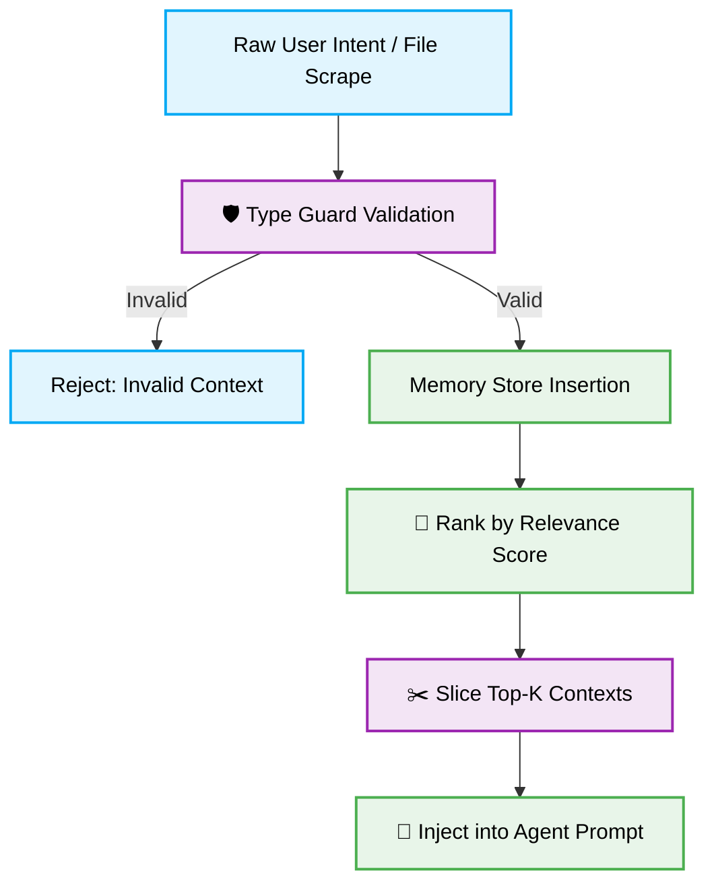

> 📦 [best-practise](../README.md) / 📄 [docs](./)
# 🤖 AI Agent Context Pruning: Deterministic Memory Management

## 1. 🎯 Context & Scope
- **Primary Goal:** Establish rigorous context pruning strategies for AI Agents to prevent token limit exhaustion, mitigate hallucination, and ensure deterministic, highly constrained generation.
- **Target Architecture:** Multi-agent Systems, Auto-GPT derivatives, LangChain, LlamaIndex, Antigravity IDE, Cursor, Windsurf.
- **Complexity Profile:** Architect level constraints for orchestrating unbounded contexts.

> [!IMPORTANT]
> **Context Overload is Fatal:** Unbounded memory injection leads directly to cognitive degradation in Large Language Models. Agents MUST dynamically prune irrelevant state before generating architectural changes.

---

## 2. 🧠 The Necessity of Context Pruning

AI Agents naturally accumulate vast amounts of data (code snippets, conversation history, API responses) during execution. Injecting the full historical state into the prompt results in severe signal-to-noise degradation. Context pruning systematically distills this state into high-density, strictly typed instructions.

### 📊 Strategy Evaluation Matrix

| Strategy | Token Efficiency | Signal-to-Noise Ratio | System Impact |
| :--- | :--- | :--- | :--- |
| **No Pruning (Naive)** | O(n) (Exponential Growth) | Poor (High Noise) | High risk of hallucinations and token exhaustion. |
| **Sliding Window** | O(1) (Constant) | Moderate | Forgets crucial early architectural constraints. |
| **Semantic Pruning** | O(1) (Optimized) | Excellent (High Signal) | Retains only deterministic constraints via Vector DBs. |

---

## 3. ⚙️ Pattern Lifecycle: Context Injection Management

### ❌ Bad Practice
Injecting unstructured, unfiltered historical states into an agent's working memory.

```javascript
// anti-pattern: injecting raw unpruned arrays
import * as fs from 'fs';

class NaiveAgentContext {
    private history: any[] = []; // Unbounded, weakly typed state

    public injectContext(newAction: any) {
        this.history.push(newAction);
    }

    public generatePrompt(): string {
        // Danger: Passing the entire history causes token exhaustion
        return `Context: ${JSON.stringify(this.history)}`;
    }
}
```

### ⚠️ Problem
- **Cognitive Overload:** Injecting thousands of lines of raw JSON directly correlates with degraded reasoning capabilities.
- **Type Safety Risks:** The usage of `any[]` allows heterogeneous, unstructured data to pollute the memory store, leading to unpredictable parsing errors.
- **Resource Exhaustion:** Naive unbounded arrays rapidly exceed the model's token limits (e.g., 128k/200k), causing `429 RESOURCE_EXHAUSTED` or hard API failures.

### ✅ Best Practice
Implement a Deterministic Semantic Pruning Engine. Define precise Data Transfer Objects (DTOs) and strictly replace `any` with `unknown` guarded by rigorous type validation.

```typescript
// best-practice: deterministic context pruning
import * as crypto from 'node:crypto';

interface DeterministicContext {
    id: string;
    action: string;
    relevanceScore: number;
    timestamp: number;
}

class SemanticPruningEngine {
    private contextStore: DeterministicContext[] = [];
    private readonly MAX_TOKENS = 4096;

    public injectContext(payload: unknown): void {
        if (!this.isValidContext(payload)) {
             throw new Error('Invalid context format. Rejected by Pruning Engine.');
        }
        this.contextStore.push(payload);
        this.prune();
    }

    private isValidContext(payload: unknown): payload is DeterministicContext {
        return (
            typeof payload === 'object' &&
            payload !== null &&
            'id' in payload &&
            'relevanceScore' in payload &&
            typeof (payload as DeterministicContext).relevanceScore === 'number'
        );
    }

    private prune(): void {
        // Sort by relevance (semantic importance) rather than just time
        this.contextStore.sort((a, b) => b.relevanceScore - a.relevanceScore);

        // Keep only top N highest-signal contexts
        this.contextStore = this.contextStore.slice(0, 10);
    }

    public getOptimizedPrompt(): string {
        return JSON.stringify(this.contextStore);
    }
}
```

### 🚀 Solution
By enforcing strict `unknown` type guards, the system guarantees that malicious or malformed context structures cannot corrupt the Agent's state. Sorting context by a computed `relevanceScore` (Semantic Pruning) rather than chronological order ensures that critical architectural directives (like `CODE_OF_CONDUCT.md`) are never evicted from the context window, resulting in deterministic, strictly typed code generation without token overflow.

---

## 4. 🗺️ Context Flow Architecture

The following flowchart illustrates the deterministic lifecycle of how external context is securely injected, validated, and pruned before reaching the AI model.



> [!NOTE]
> **Vibe-Coding Readiness:** This pruning strategy is pre-formatted for direct ingestion by agents. Any autonomous system reading this document MUST implement bounded, strongly-typed memory stores before executing wide-scale repository refactoring.
