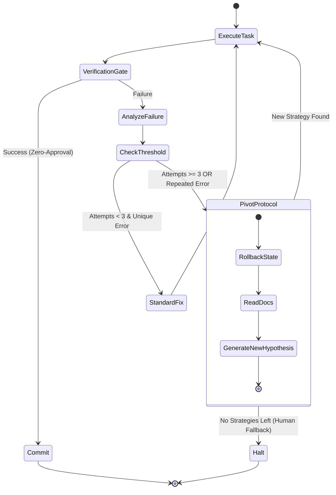

> 📦 [best-practise](../README.md) / 📄 [docs](./)
# 🔄 AI Agent Debugging Loops & Self-Correction Mechanisms

In the autonomous zero-approval workflows of 2026, one of the greatest risks is the "Infinite Debugging Loop" – an scenario where an AI Agent repeatedly tries the same failing fix, draining API tokens and blocking CI/CD pipelines. To achieve robust AI Agent Orchestration, deterministic self-correction and loop-breaking mechanisms must be integrated directly into the agent's state machine.

This guide defines the architectural standards for implementing fault-tolerant debugging and predictive self-correction loops.

## 🧱 The Loop-Breaking Architecture

Agents must track their attempt history statefully and implement a hard "Pivot Protocol" when the same error occurs sequentially.

### ❌ Bad Practice

Allowing an agent to repeatedly execute tests and read logs without maintaining an execution history or enforcing a failure threshold.

```typescript
// ❌ Anti-pattern: Stateless retry loop
async function agentFixLoop(taskId: string) {
  let success = false;
  while (!success) {
    const errorLog = await executeTests();
    if (!errorLog) {
      success = true;
      break;
    }
    // Agent tries to fix it based ONLY on the last error, ignoring history
    const patch = await generateLlmPatch(errorLog);
    await applyPatch(patch);
  }
}
```

### ⚠️ Problem

The approach above causes the agent to thrash. If the LLM generates a fix that causes the same error (or reverts to a previous state), the agent has no memory of this failure mode and will repeat the action infinitely, causing high latency and cost overruns.

### ✅ Best Practice

Implement a stateful failure counter and a deterministic "Pivot Strategy" using an orchestration boundary. When a threshold is reached, the agent MUST change its approach (e.g., reset state, search knowledge base, or request human intervention).

```typescript
// ✅ Best-pattern: Stateful Self-Correction with Pivot Thresholds
interface AgentExecutionState {
  attempts: number;
  previousErrors: string[];
  strategiesTried: string[];
}

async function deterministicFixLoop(task: TaskContext) {
  let state: AgentExecutionState = { attempts: 0, previousErrors: [], strategiesTried: [] };
  const MAX_RETRIES = 3;

  while (state.attempts < MAX_RETRIES) {
    const result = await executePipeline();

    if (result.success) return true;

    state.attempts++;
    state.previousErrors.push(result.errorHash);

    if (hasRepeatedError(state.previousErrors)) {
       // Force a pivot: Stop guessing, read documentation or rollback
       const newStrategy = await triggerPivotProtocol(state);
       state.strategiesTried.push(newStrategy.name);
       await applyStrategy(newStrategy);
    } else {
       // Standard fix attempt
       await generateAndApplyPatch(result.errorLog, state.strategiesTried);
    }
  }

  throw new Error("Systematic failure: Loop breaker activated after 3 attempts.");
}
```

### 🚀 Solution

By encapsulating the debugging process within a stateful object (`AgentExecutionState`), the orchestrator mathematically guarantees the loop will terminate. The `triggerPivotProtocol` ensures that after a repeated failure, the agent shifts cognitive contexts—for instance, switching from "code editing" to "documentation lookup (`knowledgebase_lookup`)" or "deep log analysis". This enforces systemic stability and deterministic execution.

---

## 🗺️ Self-Correction Data Flow

The following sequence demonstrates how an agent transitions from local execution into an escalated pivot state.



> [!IMPORTANT]
> The Failure Counter is absolute. If an agent tries to fix the same function 3 times with similar logic and fails, it MUST pivot.

> [!NOTE]
> During a pivot, the agent should always search for `knowledgebase_lookup` tools to find alternative solutions rather than relying purely on pre-trained context.