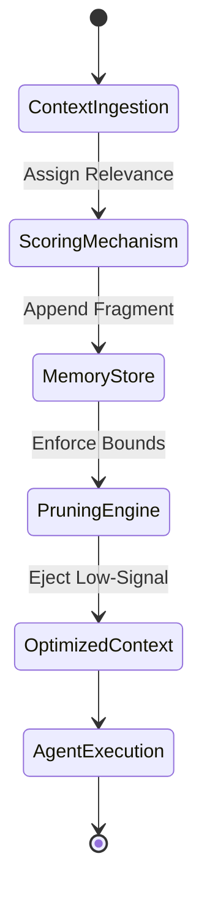

> 📦 [best-practise](../README.md) / 📄 [docs](./)

# 🤖 AI Agent Dynamic Context Pruning

In 2026, autonomous AI agent workflows strictly require deterministic context management. Unbounded context windows inevitably lead to severe AI hallucinations, rate limit exhaustion (`429 RESOURCE_EXHAUSTED`), and execution drift. Dynamic Context Pruning is a mandatory architectural pattern designed to enforce strict bounded contexts by systematically truncating, summarizing, and ejecting irrelevant memory fragments during agent orchestration.

## 🏗️ Architectural Pattern: Dynamic Context Pruning

### ❌ Bad Practice
```typescript
class AgentMemory {
  private history: string[] = [];

  public addContext(payload: string): void {
    // Appending context infinitely leads to memory exhaustion and hallucinations
    this.history.push(payload);
  }

  public getFullContext(): string {
    return this.history.join('\n');
  }
}
```

### ⚠️ Problem
> [!IMPORTANT]
> Unbounded appending of history strings significantly degrades the signal-to-noise ratio within the agent's context window. This approach fails because it directly violates memory constraints, increasing token consumption linearly and eventually breaking orchestration pipelines when processing large tasks. Furthermore, passing an entire unrestrained historical state to an LLM severely compromises the predictability of output, as outdated context MUST override recent instructions.

### ✅ Best Practice
```typescript
interface ContextFragment {
  id: string;
  timestamp: number;
  payload: string;
  relevanceScore: number;
}

class PruningMemoryManager {
  private fragments: ContextFragment[] = [];
  private readonly MAX_TOKENS = 4096;

  public injectContext(fragment: ContextFragment): void {
    this.fragments.push(fragment);
    this.enforceContextBounds();
  }

  private enforceContextBounds(): void {
    // Sort by relevance and recency, preserving only deterministic context
    this.fragments.sort((a, b) => b.relevanceScore - a.relevanceScore || b.timestamp - a.timestamp);

    // Prune low-relevance fragments to guarantee deterministic prompt execution
    if (this.fragments.length > Math.floor(this.MAX_TOKENS / 100)) {
      this.fragments = this.fragments.slice(0, Math.floor(this.MAX_TOKENS / 100));
    }
  }

  public getOptimizedContext(): ContextFragment[] {
    return this.fragments;
  }
}
```

### 🚀 Solution
Implementing a `PruningMemoryManager` ensures strict control over the agent's operational memory. By assigning a `relevanceScore` to every `ContextFragment` and continuously enforcing deterministic context bounds, this approach mathematically guarantees that the agent only computes against the highest-signal data. This architectural constraint strictly prevents token limit overflow, fundamentally reduces API overhead, and inherently mitigates scope creep in multi-agent environments.

## 🔄 Execution Workflow



> [!IMPORTANT]
> You MUST explicitly implement an exponential backoff mechanism in context resolution logic when communicating with external LLM APIs to handle edge-case rate limits securely.
