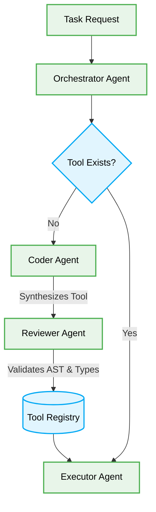

# 🤖 AI Agent Dynamic Tool Generation

## Context & Scope
- **Primary Goal:** Enable AI agents to dynamically generate, validate, and execute custom tools at runtime.
- **Target Tooling:** AI Orchestration Frameworks
- **Tech Stack Version:** 2026 Standards

<div align="center">
  

  **Deterministic blueprints for runtime tool synthesis.**
</div>

---

## 🗺️ Tool Generation Workflow



## 1. Runtime Tool Synthesis

> [!IMPORTANT]
> **AI Constraint:** Dynamically generated tools MUST be strictly typed and structurally validated via AST before execution. Any use of `eval` or unbounded execution environments MUST be blocked.

### ❌ Bad Practice
```typescript
class DynamicAgent {
  async executeTask(task: string) {
    const code = await this.llm.generateCode(task);
    // Unsafe arbitrary execution
    const result = eval(code);
    return result;
  }
}
```

### ⚠️ Problem
Using arbitrary evaluation (`eval`) for dynamically generated code introduces severe security vulnerabilities, allows AI hallucinations to crash the system, and lacks any type safety or structural boundaries.

### ✅ Best Practice
```typescript
interface ToolSchema {
  name: string;
  parameters: Record<string, unknown>;
  execute: (args: unknown) => Promise<unknown>;
}

class SafeDynamicAgent {
  constructor(private readonly validator: ASTValidator, private readonly registry: ToolRegistry) {}

  async synthesizeAndExecute(task: string) {
    const generatedCode = await this.llm.generateToolCode(task);

    // Strict AST and Type validation before registration
    const isValid = await this.validator.validateStructuralIntegrity(generatedCode);
    if (!isValid) {
      throw new Error("Generated tool failed structural validation");
    }

    const compiledTool: ToolSchema = await this.compileToSandbox(generatedCode);
    this.registry.register(compiledTool.name, compiledTool);

    return compiledTool.execute({ context: task });
  }

  private async compileToSandbox(code: string): Promise<ToolSchema> {
    // Sandbox compilation logic
    return {} as ToolSchema;
  }
}
```

### 🚀 Solution
Implementing a strict AST validation and sandboxed compilation phase guarantees that any tool generated by an agent at runtime adheres strictly to predefined security and architectural boundaries. This ensures systemic stability while allowing autonomous workflow expansion.
