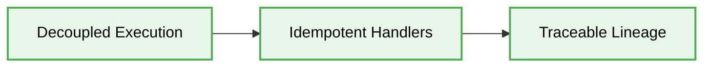
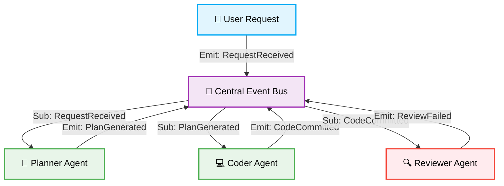

> 📦 [best-practise](../README.md) / 📄 [docs](./)

# 🔄 AI Agent Event-Driven Orchestration

In the rapidly evolving landscape of 2026, **Event-Driven AI Orchestration** is paramount for building responsive, scalable, and resilient multi-agent systems. Unlike traditional synchronous procedures where an orchestrator blocks waiting for agent responses, event-driven architectures decouple agent interactions using publish-subscribe (Pub/Sub) event buses. This enables asynchronous, reactive workflows that perfectly align with the non-deterministic latency of Large Language Models.

## 🌟 The Philosophy of Reactive Agents

An AI ecosystem should resemble a bustling stock exchange floor, not a micromanaged assembly line. Agents must react to state changes, tool executions, and user inputs independently, broadcasting their findings for other specialized agents to consume.

### Key Tenets

1. **Decoupled Execution:** Agents MUST NOT invoke each other directly. All inter-agent communication MUST route through an immutable event stream.
2. **Idempotent Handlers:** Event handlers MUST be idempotent. Network retries or duplicate LLM outputs should not corrupt the system state.
3. **Traceable Lineage:** Every event MUST carry a `correlationId` and `causationId` to reconstruct the exact contextual chain of thought across the swarm.




---

## 🏗️ Architectural Blueprint for Event Streams

A robust event-driven pipeline ensures that agents only activate when their specific preconditions are met within the event stream.



> [!IMPORTANT]
> **Orchestrator Antipattern:** Avoid creating a monolithic "Manager Agent" that delegates tasks in a synchronous loop. The Event Bus itself is the orchestrator.

---

## 📝 Implementing Reactive Handlers (The Pattern Lifecycle)

To ensure high cohesion and prevent context bleeding, event payload schemas MUST be strictly typed and validated before reaching the agent's prompt.

### ❌ Bad Practice

```typescript
// Synchronous, tightly coupled orchestration
async function runAgents(task: string) {
  const plan = await plannerAgent.generatePlan(task);
  const code = await coderAgent.writeCode(plan);
  const review = await reviewerAgent.reviewCode(code);

  if (!review.passed) {
     // Blocking recursion
     return runAgents(review.feedback);
  }
  return code;
}
```

### ⚠️ Problem

This synchronous script creates a severe bottleneck. If the `coderAgent` takes 45 seconds to generate code, the entire Node.js thread (and the user's request) is blocked. Furthermore, handling complex retry logic or multi-agent consensus within a rigid procedural flow leads to deeply nested, unmaintainable code that is prone to hallucination-induced crashes.

### ✅ Best Practice

```typescript
// Asynchronous, event-driven orchestration
const eventBus = new EventEmitter();

// Planner Agent Handler
eventBus.on('TaskRequested', async (event: TaskEvent) => {
  const plan = await plannerAgent.generate(event.payload);
  eventBus.emit('PlanGenerated', {
    correlationId: event.correlationId,
    plan
  });
});

// Coder Agent Handler
eventBus.on('PlanGenerated', async (event: PlanEvent) => {
  const code = await coderAgent.execute(event.plan);
  eventBus.emit('CodeCompleted', {
    correlationId: event.correlationId,
    code
  });
});

// Review Agent Handler
eventBus.on('CodeCompleted', async (event: CodeEvent) => {
  const review = await reviewerAgent.analyze(event.code);
  if (review.passed) {
     eventBus.emit('WorkflowSucceeded', event);
  } else {
     eventBus.emit('TaskRequested', {
       correlationId: event.correlationId,
       payload: review.feedback
     });
  }
});
```

### 🚀 Solution

By implementing a strict Pub/Sub model, each agent operates as an isolated, reactive microservice. This guarantees O(1) complexity in adding new agents (e.g., attaching a `SecurityScannerAgent` to the `CodeCompleted` event requires zero changes to the existing flow). The deterministic state is preserved within the event payload, ensuring the system remains responsive, scalable, and highly resistant to individual model timeouts.
