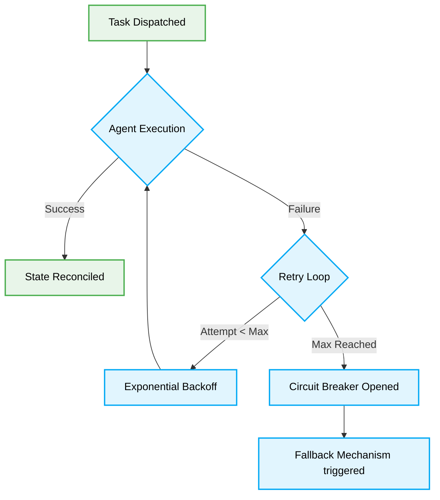

> 📦 [best-practise](../README.md) / 📄 [docs](./)
# 🛡️ AI Agent Fault Tolerance Patterns

> [!IMPORTANT]
> In 2026, building resilient AI Agent systems demands STRICT adherence to Fault Tolerance Patterns. System failures MUST NOT cascade. This document explicitly outlines MANDATORY practices for deterministic error recovery and state reconciliation in multi-agent architectures.

## 🔄 The Lifecycle of Resilient Agents

### ❌ Bad Practice
```typescript
async function executeAgentTask(prompt: string): Promise<string> {
    const result = await llm.generate(prompt);
    // Anti-pattern: Assuming the LLM always succeeds and returns valid data
    const parsedData = JSON.parse(result.text);
    return processData(parsedData);
}
```

### ⚠️ Problem
This approach lacks fault isolation. If the LLM returns an invalid format or times out, the `JSON.parse` will throw a synchronous exception, causing the entire agent process to crash. There is NO retry mechanism, NO semantic fallback, and NO state preservation, leading to unrecoverable systemic failures in production environments.

### ✅ Best Practice
```typescript
interface TaskResult {
    success: boolean;
    data?: unknown;
    error?: string;
}

async function executeAgentTaskWithResilience(prompt: string, retries: number = 3): Promise<TaskResult> {
    for (let attempt = 1; attempt <= retries; attempt++) {
        try {
            const result = await llm.generateWithTimeout(prompt, { timeoutMs: 5000 });

            // Validate against a deterministic schema before parsing
            if (!schemaValidator.isValid(result.text)) {
                throw new Error("Invalid schema format returned by LLM.");
            }

            const parsedData = JSON.parse(result.text);
            return { success: true, data: parsedData };
        } catch (error) {
            if (attempt === retries) {
                // Fallback to deterministic safe state
                return { success: false, error: error instanceof Error ? error.message : 'Unknown error' };
            }
            // Exponential backoff
            await delay(Math.pow(2, attempt) * 1000);
        }
    }
    return { success: false, error: 'Maximum retries exceeded.' };
}
```

### 🚀 Solution
> [!IMPORTANT]
> Implementing an explicit retry loop with exponential backoff and schema validation ensures the system gracefully degrades rather than crashing. The `TaskResult` interface MUST strictly define the return type, forcing the caller to handle failures explicitly. This pattern isolates external dependencies and MANDATES that agents maintain operational continuity regardless of API instability.

## 🏗️ Fault Tolerance Architecture

> [!IMPORTANT]
> Agents MUST strictly implement circuit breakers to prevent systemic overload during extended outages.



> [!NOTE]
> **Internal Routing:** For more context, refer back to the [AI Agent Orchestration Patterns](./ai-agent-orchestration-patterns.md) index.

## 📝 Compliance Checklist

> [!IMPORTANT]
> - [ ] STRICTLY wrap all external LLM calls in bounded timeout wrappers.
> [!IMPORTANT]
> - [ ] MANDATORY validation of all outputs using a deterministic JSON schema parser.
> [!IMPORTANT]
> - [ ] MUST implement exponential backoff for transient failures (e.g., rate limits).
> [!IMPORTANT]
> - [ ] Agents MUST fail gracefully and return explicitly typed error states rather than throwing unhandled exceptions.
