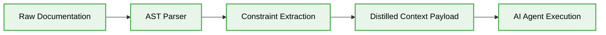

# 🤖 AI Agent Knowledge Distillation

In 2026, AI Agent Knowledge Distillation MUST be implemented as a deterministic mechanism to condense large architectural context into highly optimized, deterministic instruction sets for autonomous agents.

## 🏗️ Architectural Foundations

Knowledge Distillation processes MUST compress verbose documentation into O(1) context lookups, eliminating redundant token usage and ensuring strict adherence to systemic constraints during Vibe Coding sessions.

### ❌ Bad Practice

```typescript
// Injecting unoptimized, entire raw documents into the agent's context window
import * as fs from 'fs';

interface Agent {
    execute(options: { context: string }): Promise<void>;
}

export async function generateCode(agent: Agent): Promise<void> {
    const fullDocs = await fs.promises.readFile('./docs/large-architecture-guide.md', 'utf-8');
    await agent.execute({ context: fullDocs });
}
```

### ⚠️ Problem

Injecting raw, uncompressed text introduces severe cognitive overload for AI Agents, consuming excessive tokens and resulting in unpredictable hallucinations. The execution latency increases linearly with context size, leading to systemic performance degradation and violating strict time-to-execution constraints.

### ✅ Best Practice

> [!NOTE]
> **Internal Routing:** For more context, refer back to the [docs](./) index.

```typescript
// Deterministic distillation pipeline injecting strictly typed rule sets
import * as fs from 'fs';

interface DistilledContext {
    constraints: string[];
    mandatoryPatterns: string[];
}

interface Agent {
    execute(options: { context: DistilledContext }): Promise<void>;
}

function isDistilledContext(data: unknown): data is DistilledContext {
    if (typeof data !== 'object' || data === null) {
        return false;
    }
    const obj = data as Record<string, unknown>;
    return Array.isArray(obj.constraints) && Array.isArray(obj.mandatoryPatterns);
}

export async function getDistilledContext(): Promise<DistilledContext> {
    const rawRule = await fs.promises.readFile('./docs/rule.json', 'utf-8');
    const parsed: unknown = JSON.parse(rawRule);

    if (!isDistilledContext(parsed)) {
        throw new Error('STRICT VALIDATION FAILED: Invalid context payload format.');
    }

    return parsed;
}

export async function generateCodeDeterministic(agent: Agent): Promise<void> {
    const context = await getDistilledContext();
    await agent.execute({ context });
}
```

### 🚀 Solution

By implementing a deterministic Knowledge Distillation pipeline with strict runtime type guards, the system STRICTLY filters out orthogonal information and provides AI Agents with explicit, structured parameters. This ensures precise, isolated token allocation and guarantees deterministic execution output without hallucinations. This architectural pattern achieves constant O(1) lookup efficiency for context variables and enforces zero-trust systemic stability, rendering the implementation far more secure and performant than the untyped, raw text injection anti-pattern.

## 🔄 Distillation Workflow

The workflow below illustrates the deterministic process of transforming raw architecture data into isolated context boundaries.


