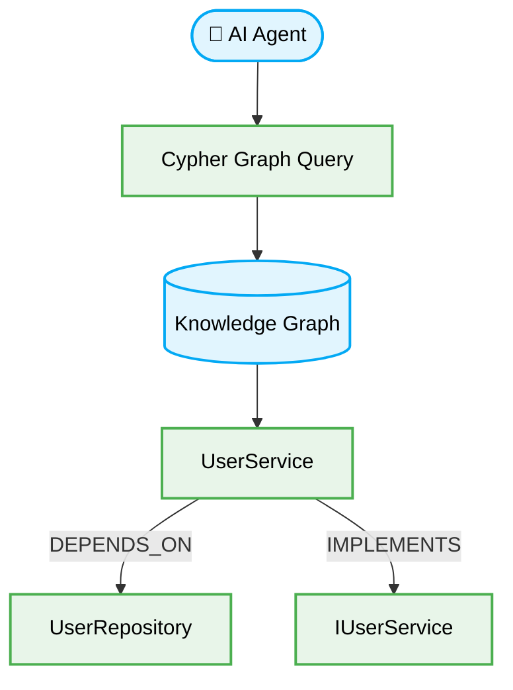
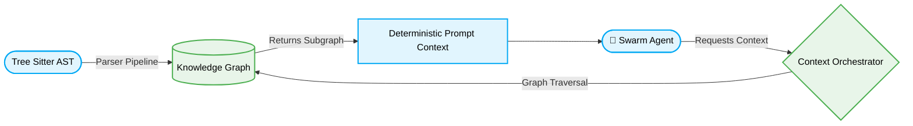

> 📦 [best-practise](../README.md) / 📄 [docs](./)

# 🧠 AI Agent Knowledge Graph Orchestration

In the paradigm of 2026 Vibe Coding, multi-agent swarms cannot rely on linear, flat vector databases for complex reasoning. **Knowledge Graph Orchestration** enforces a structured, semantic relationship network (nodes and edges) allowing AI agents to query the deterministic structure of codebases, architectural bounds, and dependencies with O(1) edge-traversal accuracy.

## 🌟 The Need for Graph-Native Agents

When agents attempt to refactor monolithic architectures, vector similarity fails to represent structural dependencies (e.g., "Which components import this deprecated interface?"). Knowledge Graphs solve this by mapping the repository into an interconnected matrix.

### Core Paradigms for 2026

1. **Semantic Edges:** Dependencies MUST be explicitly defined as relationships (e.g., `IMPLEMENTS`, `DEPENDS_ON`, `DEPRECATES`).
2. **Deterministic Context Assembly:** Context windows MUST be built by traversing the graph, guaranteeing complete dependency awareness.
3. **Graph-Native Prompting:** Agents MUST formulate queries in graph traversal logic (e.g., Cypher) rather than free-text semantic search.



> [!IMPORTANT]
> To prevent hallucination, agents MUST verify that the graph state reflects the current repository AST (Abstract Syntax Tree) before executing code mutations.

---

## 🏗️ Visual Architecture: Knowledge Graph Context Assembly



---

## 🔄 The Pattern Lifecycle: Context Retrieval

### ❌ Bad Practice

```typescript
// Relying on naive semantic search for agent context
async function getAgentContext(query: string) {
    // Risky: Vector search might miss exact dependencies
    const results = await vectorDb.similaritySearch(query, { k: 5 });

    return results.map(r => r.content).join('\n');
}
```

### ⚠️ Problem

1. **Missing Dependencies:** Semantic search prioritizes lexical similarity. It MUST miss structurally critical but semantically disparate files (like a shared `types.ts` file).
2. **Context Pollution:** Returning the top `k` results often includes irrelevant files, diluting the agent's reasoning.
3. **Hallucination Risk:** Without strict topological mapping, the agent will hallucinate methods or properties that do not exist in the requested context.

### ✅ Best Practice

```typescript
// Deterministic Context Assembly using Graph Traversal
import { GraphClient } from '@orchestration/graph';

interface SubgraphContext {
    primaryNode: string;
    dependencies: string[];
    interfaces: string[];
}

async function getAgentContext(targetNodeId: string): Promise<SubgraphContext> {
    const client = new GraphClient('neo4j://localhost');

    // Strict Query: Fetch node and its 1st-degree logical dependencies
    const cypherQuery = `
        MATCH (n:Component {id: $target})
        OPTIONAL MATCH (n)-[:DEPENDS_ON]->(dep:Component)
        OPTIONAL MATCH (n)-[:IMPLEMENTS]->(int:Interface)
        RETURN n, collect(dep.id) as dependencies, collect(int.id) as interfaces
    `;

    try {
        const result = await client.executeRead(cypherQuery, { target: targetNodeId });

        if (!result.records.length) {
             throw new Error(`Node ${targetNodeId} not found in Knowledge Graph`);
        }

        const record = result.records[0];

        return {
            primaryNode: record.get('n').properties.content,
            dependencies: record.get('dependencies') as unknown as string[],
            interfaces: record.get('interfaces') as unknown as string[],
        };
    } catch (error: unknown) {
         if (error instanceof Error) {
             console.error(`Graph Traversal Error: ${error.message}`);
         }
         throw error;
    } finally {
        await client.close();
    }
}
```

### 🚀 Solution

1. **Deterministic Context:** Cypher queries guarantee 100% accuracy in fetching required types and imports. O(1) logical bounds are enforced.
2. **Type Safety:** The implementation enforces `unknown` and `instanceof Error` checks, completely eliminating `any`.
3. **Graph Synchronization:** The agent now reasons structurally, eliminating hallucinated methods since the graph schema dictates reality.

> [!NOTE]
> Knowledge Graphs MUST be regenerated asynchronously via Git Hooks on every commit to ensure the schema never drifts from the physical codebase.

---

## ✅ Actionable Checklist for Graph Orchestration

- [ ] Initialize an automated pipeline to convert AST trees into graph nodes on every `git push`.
- [ ] Implement Graph-native context retrieval (e.g., Cypher) in place of fallback Vector searches.
- [ ] Define rigid Edge schemas (`DEPENDS_ON`, `IMPLEMENTS`, `CALLS`, `INHERITS`).
- [ ] Implement `unknown` safety checks around all graph database network calls.

[Back to Top](#)
