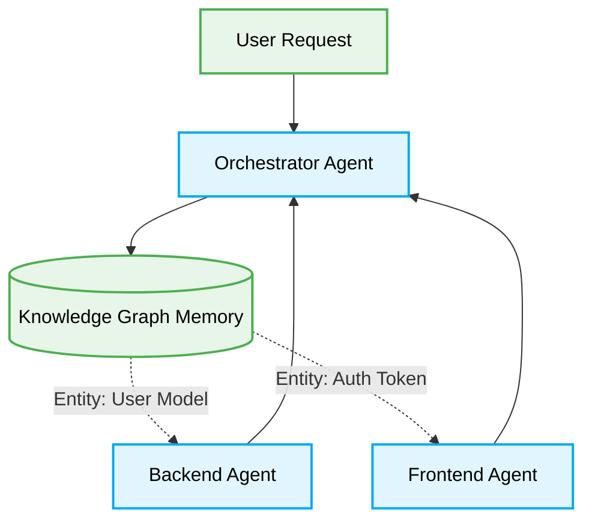

# 🤖 Knowledge Graph Orchestration for Multi-Agent Systems

In 2026, relying solely on isolated vector databases for agent memory leads to fragmented contexts. **Knowledge Graph Orchestration** integrates deterministic relationship mapping, enabling agents to parse structural dependencies (e.g., how a UI component impacts a backend API) rather than just semantic proximity.

## 🏗️ Architectural Topology

A Knowledge Graph (KG) serves as the centralized nervous system for the multi-agent Orchestrator.



---

## 🔄 The Pattern Lifecycle: Stateful Agent Routing

### ❌ Bad Practice

```typescript
async function routeAgentTask(query: string) {
    // Relying on flat semantic search limits contextual awareness
    const context = await vectorDB.similaritySearch(query);
    const result = await llm.generate(query, context);
    return result;
}
```

### ⚠️ Problem

Semantic similarity fails when tasks require strict dependency resolution. For example, updating a database schema requires updating the API DTOs and the frontend interfaces. A flat vector search might only return the database schema, causing the agent to hallucinate or break cross-domain dependencies, severely degrading reliability in zero-approval environments.

### ✅ Best Practice

```typescript
async function routeAgentTaskWithKG(query: string) {
    // Querying the Knowledge Graph to retrieve explicit structural relationships
    const { nodes, edges } = await knowledgeGraph.queryDependencies(query);

    // Constructing a strict dependency tree for the LLM
    const structuredContext = buildDependencyTree(nodes, edges);

    const result = await llm.generateWithStrictContext(query, structuredContext);

    // Deterministic validation against known graph invariants
    if (!knowledgeGraph.validateOutput(result)) {
        throw new Error("KG invariant violation: Generated code breaks known dependencies.");
    }

    return result;
}
```

### 🚀 Solution

By structuring agent memory as a Knowledge Graph, the Orchestrator can deterministically inject dependency trees into the worker agent's context window. This prevents hallucinations related to missing imports or broken API contracts, ensuring systemic stability. The Orchestrator strictly validates generated code against the Graph's invariants before finalizing the mutation.

> [!NOTE]
> Ensure all Knowledge Graph nodes are strictly typed. Do not allow agents to dynamically generate unstructured nodes without explicit Orchestrator validation.

> [!IMPORTANT]
> **Internal Routing:** For more context, refer back to the [AI Agent Orchestration](./ai-agent-orchestration.md) guidelines.
