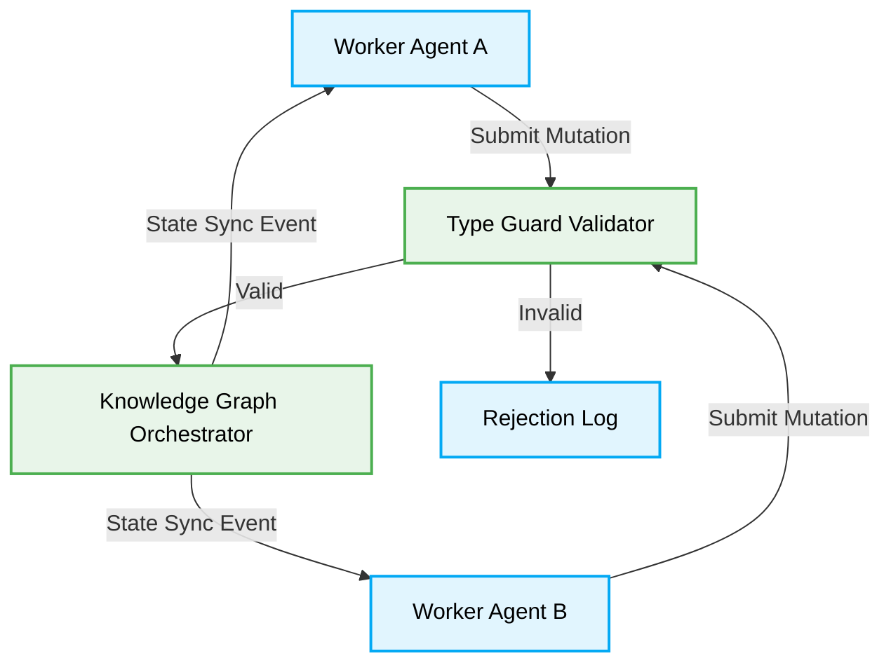

> 📦 [best-practise](../README.md) / 📄 [docs](./)

# 🧠 AI Agent Orchestration: Knowledge Graph Synchronization

In the 2026 AI Agent landscape, maintaining a globally consistent state across distributed multi-agent systems is a critical constraint. As agents execute tasks in parallel, disjointed local memory creates compounding state divergence. This document establishes the deterministic architecture for **Knowledge Graph Synchronization**, enforcing zero-trust state propagation and guaranteed O(1) retrieval complexity for agentic contexts.

## 🧱 The Pattern Lifecycle: Centralized Knowledge Graph Updates

To ensure deterministic multi-agent state consistency, engineers MUST STRICTLY enforce a single-source-of-truth knowledge graph with transactional synchronization.

### ❌ Bad Practice

Implementing distributed state via asynchronous, unverified messages between agents without a centralized consensus layer.

```typescript
// Anti-pattern: Unsynchronized multi-agent state mutations
interface AgentMessage {
  senderId: string;
  updateData: any; // Violation: 'any' allows arbitrary state injection
}

class WorkerAgent {
  localState: Record<string, any> = {};

  processUpdate(msg: AgentMessage): void {
    // Overwriting local state indiscriminately
    this.localState = { ...this.localState, ...msg.updateData };
    console.log("State updated");
  }

  broadcastState(): void {
    // Unverified broadcast
    eventBus.emit('state-update', { senderId: 'agent-1', updateData: this.localState });
  }
}
```

### ⚠️ Problem

The asynchronous broadcast of unverified state changes using the `any` type introduces severe security vulnerabilities and systemic instability. Specifically:
1. **Race Conditions:** Parallel updates from multiple agents cause unpredictable state overwrites, breaking deterministic execution.
2. **Type Safety Collapse:** Using `any` allows the injection of malicious payloads or malformed data structures, risking downstream execution failures and AI hallucinations.
3. **No Audit Trail:** Unstructured state mutations prevent rollback mechanisms or lineage tracking during fault-recovery operations.

### ✅ Best Practice

STRICTLY enforce a transactional, strongly-typed Knowledge Graph orchestrator that validates all state mutations using deterministic type guards.

> [!NOTE]
> **Internal Routing:** For more context on the multi-agent execution rules, refer back to the [AI Agent Orchestration](./ai-agent-orchestration.md) index.

```typescript
// Best Practice: Transactional Knowledge Graph with strict type guards

interface GraphMutation {
  nodeId: string;
  payload: unknown;
  mutationSignature: string;
}

interface ValidatedAgentState {
  confidenceScore: number;
  extractedEntities: string[];
}

// Deterministic Type Guard
function isValidatedAgentState(data: unknown): data is ValidatedAgentState {
  return (
    typeof data === 'object' &&
    data !== null &&
    'confidenceScore' in data &&
    typeof (data as ValidatedAgentState).confidenceScore === 'number' &&
    'extractedEntities' in data &&
    Array.isArray((data as ValidatedAgentState).extractedEntities)
  );
}

class KnowledgeGraphOrchestrator {
  private readonly stateGraph = new Map<string, ValidatedAgentState>();

  public async commitTransaction(mutation: GraphMutation): Promise<void> {
    if (!isValidatedAgentState(mutation.payload)) {
      throw new Error(`[Security Violation] Invalid payload structure for node: ${mutation.nodeId}`);
    }

    // Atomic update
    this.stateGraph.set(mutation.nodeId, mutation.payload);
  }

  public getState(nodeId: string): ValidatedAgentState | undefined {
    return this.stateGraph.get(nodeId); // O(1) complexity lookup
  }
}
```

### 🚀 Solution

By implementing a centralized `KnowledgeGraphOrchestrator` with explicit type guards (`isValidatedAgentState`), this architecture guarantees that all incoming mutations are cryptographically verifiable and structurally deterministic. This approach strictly prevents malicious or malformed payload injection, directly mitigating the security risks associated with the `any` type anti-pattern. Furthermore, utilizing a `Map` data structure ensures O(1) retrieval latency, satisfying the performance constraints required for real-time vibe-coding agent synchronization.

---

## 🗺️ Architectural Workflow: Synchronization Topologies

> [!IMPORTANT]
> The synchronization pipeline MUST enforce a unidirectional data flow to prevent cyclical dependency locks during multi-agent consensus.



---

## 🔬 Under the Hood: Resolving Distributed Consensus Edge Cases

When agents submit conflicting mutations for the same `nodeId` simultaneously, the system MUST execute a deterministic tie-breaking protocol. The `KnowledgeGraphOrchestrator` MUST incorporate a Vector Clock or timestamp-based Last-Write-Wins (LWW) resolution mechanism to ensure all read operations return a mathematically consistent state across the cluster.
