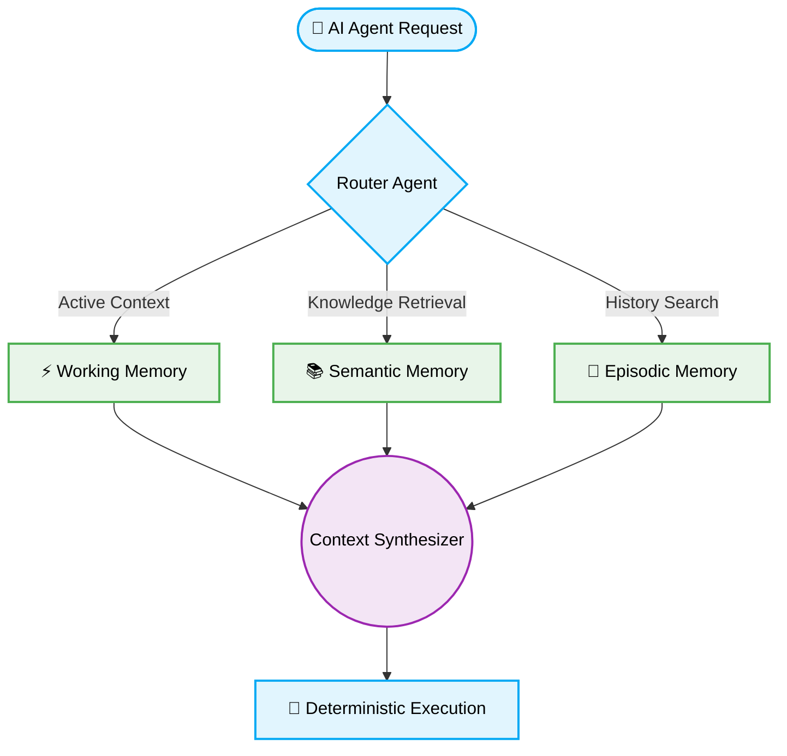

# 🧠 AI Agents: Production-Ready Best Practices for Memory Architectures

Implementing AI Agents requires adhering to production-ready best practices for memory architectures. Establishing a scalable, deterministic state management layer prevents context degradation during multi-turn orchestration and Vibe Coding sessions.

---

## 🏗️ Architectural Overview

> [!NOTE]
> AI Agent Memory Architectures must balance low-latency retrieval with high-context precision. Designing stateful memory involves segregating short-term episodic memory from long-term semantic storage.

### Core Memory Components

| 🧩 Component | 📊 Primary Function | 💾 Storage Technology | 🚀 LSI Keyword Priority |
| :--- | :--- | :--- | :--- |
| **Working Memory** | Real-time context retention for the active session. | Redis / In-Memory | Session State, Context Window |
| **Episodic Memory** | Sequential interaction logs and trace histories. | PostgreSQL / NoSQL | Event Sourcing, Audit Logging |
| **Semantic Memory** | Knowledge base graphs and embeddings retrieval. | Vector DB (Pinecone/Milvus) | RAG, Semantic Search, Embeddings |

---

## ⚙️ Memory State Synchronization Pattern



---

## 🔄 The Pattern Lifecycle: Memory Context Injection

### ❌ Bad Practice
```typescript
async function getAgentContext(userId: string) {
    // Synchronous, non-paginated retrieval of all historical data
    const history = await db.query(`SELECT * FROM agent_history WHERE user_id = '${userId}'`);
    const knowledge = await db.query(`SELECT * FROM knowledge_base`);

    return {
        prompt: "Execute task",
        context: history + knowledge // Overflows context window
    };
}
```

### ⚠️ Problem
Loading the entire interaction history and global knowledge base into the prompt leads to catastrophic context window overflow, extreme latency, and severe AI hallucinations. SQL injection vulnerabilities are also present, and synchronous queries block the main thread.

### ✅ Best Practice
```typescript
import { Pinecone } from '@pinecone-database/pinecone';
import Redis from 'ioredis';

const redis = new Redis(process.env.REDIS_URL as string);
const pc = new Pinecone({ apiKey: process.env.PINECONE_API_KEY as string });

async function getAgentContext(userId: string, currentQuery: string, queryEmbedding: number[]): Promise<unknown> {
    // Parallel async execution for working and semantic memory retrieval
    const [workingMemory, semanticMemory] = await Promise.all([
        redis.lrange(`session:${userId}:history`, 0, 9), // Paginated short-term memory
        pc.index('knowledge-base').query({
            topK: 5,
            vector: queryEmbedding,
            includeMetadata: true
        })
    ]);

    return {
        role: "system",
        context: {
            recentHistory: workingMemory,
            relevantFacts: semanticMemory.matches
        }
    };
}
```

### 🚀 Solution
Implementing a segregated memory architecture ensures systemic stability. Using Redis for immediate, rate-limited working memory and a Vector Database for Top-K semantic retrieval prevents context overflow. `Promise.all` guarantees non-blocking parallel execution, maintaining optimal Big-O efficiency and 2026 AI orchestration standards.

---

## 📋 Actionable Checklist for Memory Integration

- [ ] Initialize distinct storage layers for Working, Episodic, and Semantic memory.
- [ ] Enforce Top-K pagination for all Vector Database queries to protect the context window.
- [ ] Implement `Promise.all` for parallel fetching of memory contexts.
- [ ] Sanitize and type-guard all retrieved memory objects to prevent injection vulnerabilities.
- [ ] Utilize environment variables (`process.env.REDIS_URL`) for secure database connections.

[Back to Top](#)
