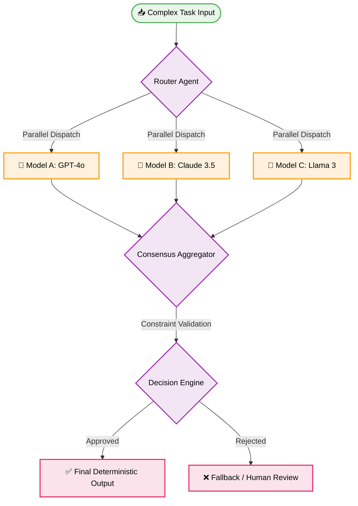

<a id="top"></a>

# 🤖 AI Agent Orchestration Multi-Model Consensus Best Practices

This document strictly defines the **best practices** and constraints for implementing **AI Agent Orchestration Multi-Model Consensus** in 2026 architectures. It serves as a deterministic reference for Vibe Coding and Autonomous Orchestration pipelines.

---

## 🎯 Executive Summary

Multi-Model Consensus is a deterministic orchestration pattern where multiple distinct LLMs (e.g., Claude 3.5 Sonnet, GPT-4o, Llama 3) evaluate the same complex prompt in parallel. A designated Orchestrator Agent then synthesizes the outputs, scoring them against defined architectural constraints before producing a final deterministic response. This mitigates hallucination risks and enforces systemic stability in zero-approval environments.

> [!NOTE]
> This pattern is strictly required for high-risk zero-approval mutations (e.g., database schema changes, global infrastructure refactors).

---

## 📊 Consensus Topology Lifecycle



---

## 🛠️ The Consensus Pattern Lifecycle

### ❌ Bad Practice

```typescript
async function resolveTask(prompt: string) {
    // Single point of failure: relying on one model for critical system changes
    const response = await singleLLM.generate(prompt);
    await executeSystemCommand(response.code); // ❌ High risk of hallucinated execution
}
```

### ⚠️ Problem

Single-model reliance in zero-approval agentic workflows creates a catastrophic single point of failure. If the model hallucinates or deviates from strict architectural constraints, it can execute destructive mutations on the codebase or database.

### ✅ Best Practice

```typescript
async function resolveTaskConsensus(prompt: string, constraints: string[]) {
    // Parallel execution across diverse model architectures
    const [claudeOutput, gptOutput, llamaOutput] = await Promise.all([
        claudeAgent.generate(prompt),
        gptAgent.generate(prompt),
        llamaAgent.generate(prompt)
    ]);

    // Orchestrator aggregates and verifies outputs against strict constraints
    const finalResolution = await orchestratorAgent.evaluateConsensus(
        [claudeOutput, gptOutput, llamaOutput],
        constraints
    );

    if (!finalResolution.isValid) {
        throw new Error("Consensus failed: Outputs violated architectural constraints.");
    }

    await executeSystemCommand(finalResolution.code);
}
```

### 🚀 Solution

By enforcing `Promise.all` parallelization across isolated models, the Orchestrator can triangulate the optimal, safest response. The strict validation against architectural constraints ensures that even if one model hallucinates, the consensus algorithm rejects the anomalous output, ensuring deterministic, stable execution in production.

---

## ⚙️ Consensus Evaluation Matrix

> [!IMPORTANT]
> The Orchestrator Agent must use the following weighting matrix when evaluating raw outputs.

| Evaluation Metric | Weight | Constraint Definition |
| :--- | :--- | :--- |
| **Architectural Safety** | 40% | Adherence to existing structural rules (e.g., FSD, MVC). |
| **Determinism** | 30% | Output reproducibility and lack of extraneous conversational text. |
| **Performance (Big-O)** | 20% | Avoidance of synchronous blocking and nested loop inefficiencies. |
| **Type Safety** | 10% | Proper use of strict typings (`unknown` instead of `any`). |

---

## 📋 Actionable Checklist

- [ ] Implement `Promise.all` for parallel multi-model dispatching to minimize latency.
- [ ] Define explicit Constraints Arrays to pass into the Orchestrator for evaluation.
- [ ] Ensure the Orchestrator has a fallback protocol (e.g., Human Review) if consensus fails validation.
- [ ] Monitor and log consensus drift between models to optimize future prompt routing.

---

[Back to Top](#top)
